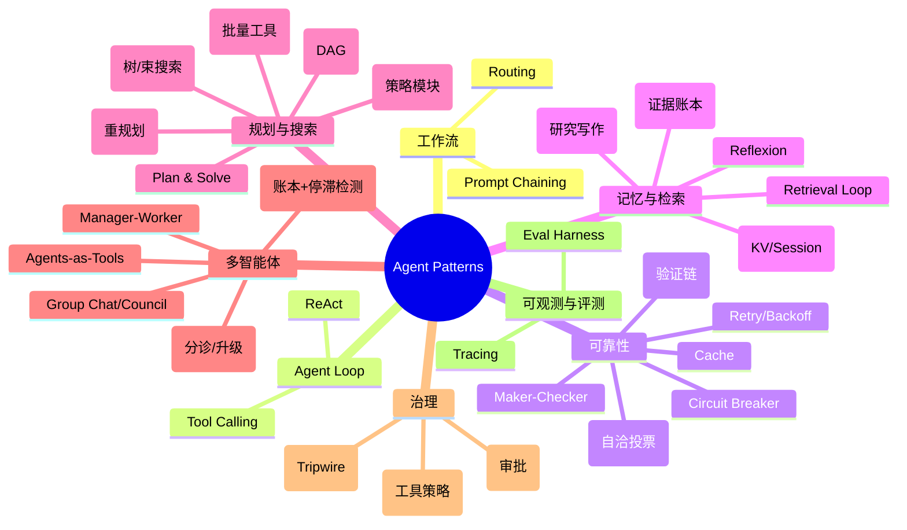
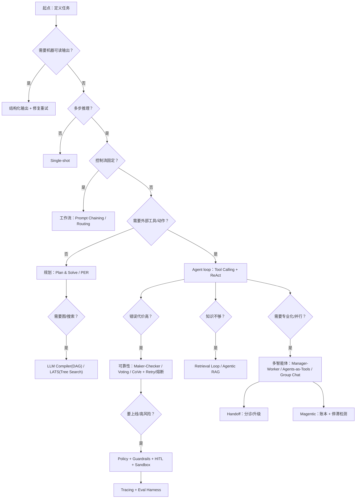

# Agent 设计模式地图

这是一份以“**问题驱动**”组织的 Agent Design Patterns 地图：  
不是在比谁更“高级”，而是在解释——**当系统引入新能力后，会出现哪些新失败模式，于是人们发明了哪些模式来对付它们**。

## 演化主线（从简单到复杂）

1. **Single-shot**（无 loop）：快、便宜，但不稳。
2. **结构化输出**：当你需要 JSON/Schema 时，必须引入“解析 + 修复重试”。
3. **工作流**：当控制流可预先确定，用 Prompt Chaining / Routing。
4. **Agent loop**：当下一步依赖环境观测，用 Tool Calling + ReAct（Reason-Act-Observe）。
5. **可靠性**：当错误代价高，用 Maker-Checker / Voting / CoVe + retry/熔断/降级。
6. **记忆与检索**：当知识不足，用 Retrieval Loop → Agentic RAG（证据账本）。
7. **规划与搜索**：当任务长且不确定，用 Plan & Solve / PER / REWOO / DAG / Tree Search。
8. **多智能体**：当需要专业化与规模，用 Manager-Worker / Agents-as-Tools / Group Chat / Handoff / Magentic。
9. **治理与评测**：当要上线，用 Policy + Guardrails + HITL + Tracing + Eval Harness。

## 知识导图（模式家族）

## “看到 X 就用 Y”（选择决策树）

## 本书结构

- **基建（Building Blocks）**：模式复用的最小运行时能力（结构化输出、工具、loop、trace、memory…）
- **模式（Patterns）**：每个模式一页，强调 *解决的问题 → 核心 loop → 取舍 → 演化路径*
- **治理与评测**：如何上线（安全/权限/审批），以及如何做回归（eval）

