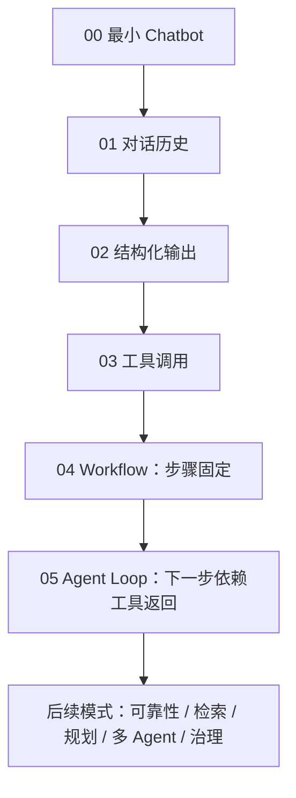

# Agent Patterns Lab

这本小册子讲的不是“怎么使用这个 repo”，而是：**一个普通 Chatbot 为什么会一步步演化成 Agent 系统。**

我们用同一个贯穿案例——旅游规划助手——从最小代码开始：

```text
Chatbot -> 对话历史 -> 结构化输出 -> 工具调用 -> Workflow -> Agent Loop -> 可靠性/检索/规划/多 Agent/治理
```

## 主线图



## 为什么从 Chatbot 开始

因为 Agent 不是凭空出现的。它是 Chatbot 在真实任务里不断撞墙后长出来的结构：

| 撞到的问题 | 为什么会长出新模式 |
|---|---|
| 用户下一句还指代上一句 | 需要对话历史 |
| 文本输出不好接程序 | 需要结构化输出 |
| 模型不知道天气/路线/政策 | 需要工具调用和检索 |
| 步骤已经确定 | 用 Workflow，不要让模型乱决定 |
| 下一步取决于工具返回 | 需要 Agent Loop |
| Agent 会自信地错 | 需要 Maker-Checker、CoVe、Voting |
| 任务变长，计划会变 | 需要规划、重规划、搜索 |
| 一个 Agent 背太多职责 | 需要多 Agent 协作 |
| 它要订票/付款/取消 | 需要权限、护栏、人工确认和评测 |

## 从这里读

1. [从这里开始](start_here.md)
2. [00：最小 Chatbot](tutorial/00_chatbot.md)
3. [01：对话历史](tutorial/01_conversation.md)
4. [02：结构化输出](tutorial/02_structured_output.md)
5. [03：工具调用](tutorial/03_tool_calling.md)
6. [04：Workflow](tutorial/04_workflow.md)
7. [05：Agent Loop](tutorial/05_agent_loop.md)
8. [选择模式](choose_pattern.md)

## 当前覆盖的模式

目前正式列了 **21 个 Agent 设计模式**：

- **Workflow：2 个** — Prompt Chaining、Routing
- **Agent Loop：1 个** — ReAct
- **Reliability：3 个** — Maker-Checker、Voting、CoVe
- **Memory & Retrieval：4 个** — Retrieval Loop、Agentic RAG、Reflexion、STORM
- **Planning & Search：6 个** — Plan & Solve、PER、ReWOO、LLM Compiler、LATS、Self-Discovery
- **Multi-Agent：5 个** — Manager-Worker、Agents-as-Tools、Group Chat、Handoff、Magentic Orchestration

配套的 Building Blocks、Governance、Evaluation 页面不是“模式本体”，但是真正写 Agent 时绕不开。
