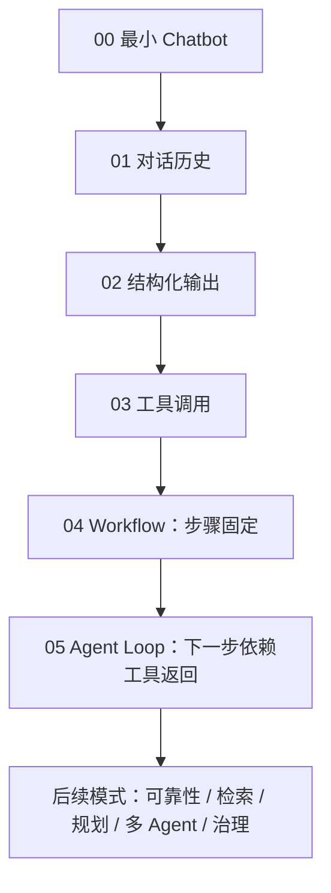
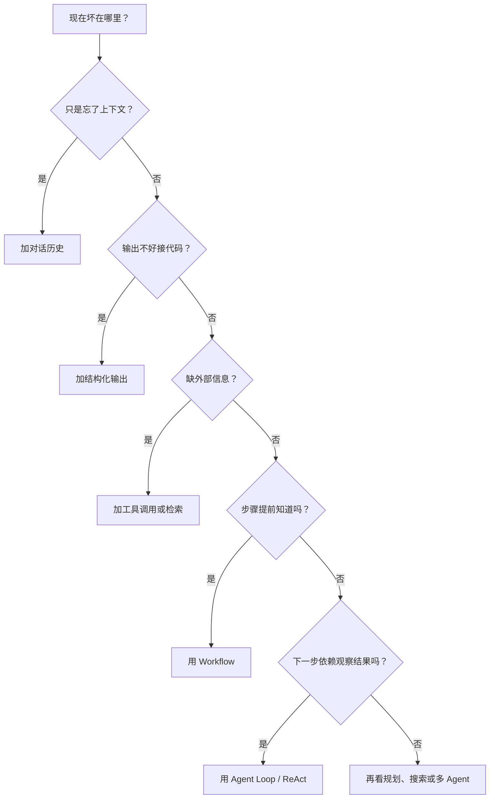

# Agent Patterns Lab

很多 Agent 教程一上来就讲 ReAct、规划、多 Agent。
这当然没错，但很容易让人有一种错觉：Agent 是某个很大的框架，或者某种神秘的提示词写法。

我更愿意从反方向讲。

先写一个很普通的 Chatbot：用户发一句话，模型回一段文本。它一开始看起来能用。然后你让它规划旅行，问题就来了：它不知道今天会不会下雨，忘了用户上一轮说的预算，输出格式一会儿像攻略、一会儿像散文；你让它查资料，它又不知道该查几次、什么时候停。

Agent 设计模式就是从这些麻烦里长出来的。

这本小册子不是“怎么使用这个 repo”。它更像一张地图：当一个普通 Chatbot 在某个地方撑不住时，下一层结构应该怎么加，为什么要加，以及加完以后会付出什么代价。

贯穿案例是旅游规划助手。我们从这行代码开始：

```python
answer = model.complete(messages)
```

然后一步步往前走：

```text
Chatbot -> 对话历史 -> 结构化输出 -> 工具调用 -> Workflow -> Agent Loop -> 可靠性/检索/规划/多 Agent/治理
```

## 这篇文章解决的问题

你读完以后，应该能回答三件事：

- Agent 和普通 Chatbot 的差别到底在哪里。
- 每个设计模式是在修哪一种失败。
- 什么时候该加一层结构，什么时候不该加。

如果只能记住一句话，那就是：先定位失败，再选择模式。

## 它是如何运作的

每个模式页都会按同一个思路写：

1. 先说它解决什么问题。
2. 再画一张流程图。
3. 接着给一个能和 Python 代码对上的例子。
4. 最后说明它的边界：什么时候有用，什么时候会让系统变重。

这样读起来慢一点，但不容易把模式名背成术语表。

## 主线图



## 为什么从 Chatbot 开始

因为 Agent 不是凭空出现的。
它是 Chatbot 在真实任务里不断撞墙后长出来的结构：

| 撞到的问题 | 为什么会长出新模式 |
|---|---|
| 用户下一句还指代上一句 | 需要对话历史 |
| 文本输出不好接程序 | 需要结构化输出 |
| 模型不知道天气/路线/政策 | 需要工具调用和检索 |
| 步骤已经确定 | 用 Workflow，不要让模型乱决定 |
| 下一步取决于工具返回 | 需要 Agent Loop |
| Agent 会自信地错 | 需要 Maker-Checker、CoVe、Voting |
| 任务变长，计划会变 | 需要规划、重规划、搜索 |
| 一个 Agent 背太多职责 | 需要多 Agent 协作 |
| 它要订票/付款/取消 | 需要权限、护栏、人工确认和评测 |

这张表也给了一个很朴素的判断方式：



别急着把所有模式都堆上去。
先说清楚当前失败是什么，再选最小的下一层。

## 什么时候用这张地图

适合这些情况：

- 你想写一篇 Agent 设计模式 report。
- 你想用纯 Python 看懂模式的最小实现。
- 你已经听过很多模式名，但它们之间的关系还是散的。

不太适合这些情况：

- 你只想马上接入一个生产框架。
- 你要找某个 SDK 的完整 API 手册。
- 你期待一套可以直接上线的业务系统。

这里更像拆机图。
先把结构看清楚，再决定要不要装回产品里。

## 常见失败模式

这份材料自己也有容易失败的地方：

- 如果只列模式名，会像术语清单。
- 如果只写 repo 说明，会像 README。
- 如果只讲原理不放代码，读者很难知道模式到底长什么样。

所以这里会尽量把解释、流程图和最小代码放在一起。

## 从这里读

1. [从这里开始](start_here.md)
2. [00：最小 Chatbot](tutorial/00_chatbot.md)
3. [01：对话历史](tutorial/01_conversation.md)
4. [02：结构化输出](tutorial/02_structured_output.md)
5. [03：工具调用](tutorial/03_tool_calling.md)
6. [04：Workflow](tutorial/04_workflow.md)
7. [05：Agent Loop](tutorial/05_agent_loop.md)
8. [选择模式](choose_pattern.md)

## 当前覆盖的模式

目前正式列了 **21 个 Agent 设计模式**：

- **Workflow：2 个** — Prompt Chaining、Routing
- **Agent Loop：1 个** — ReAct
- **Reliability：3 个** — Maker-Checker、Voting、CoVe
- **Memory & Retrieval：4 个** — Retrieval Loop、Agentic RAG、Reflexion、STORM
- **Planning & Search：6 个** — Plan & Solve、PER、ReWOO、LLM Compiler、LATS、Self-Discovery
- **Multi-Agent：5 个** — Manager-Worker、Agents-as-Tools、Group Chat、Handoff、Magentic Orchestration

配套的 Building Blocks、Governance、Evaluation 页面不是“模式本体”，但是真正写 Agent 时绕不开。

如果你只想先建立直觉，读前六章就够了。
如果你想写一篇完整 report，再按“选择模式”页面跳到每个模式页。
