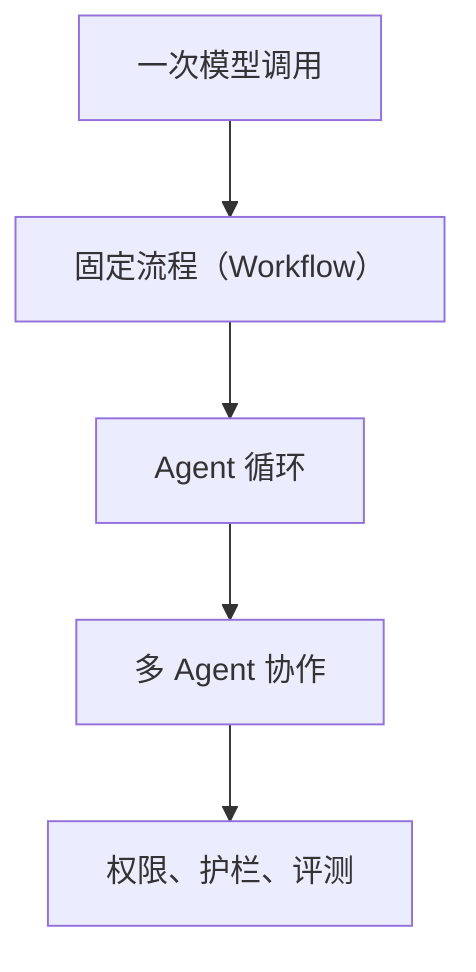

# 心智模型

Agent 设计模式之所以容易乱，不是因为模式太多，而是因为我们经常把几个层级混在一起讲。

这本小册子的主线是：**能用更简单的结构解决，就不要急着上更复杂的 Agent。** 我们会用同一个旅游规划助手，看它为什么一步步需要更多结构。

## 一张图



越往右，系统越灵活；也越贵、越慢、越难测试。复杂度不是免费的。

## 1. 一次模型调用

如果任务只需要一次模型调用，就停在这里：

- 总结一段文字
- 分类一个输入
- 改写一句话
- 抽取一个字段

这不是“不够 Agent”。这是工程上的好选择。

在旅游助手里，如果用户只是问“把这段行程改写得更口语”，一次模型调用就够。

## 2. 固定流程（Workflow）

Workflow 的关键是：**路径由代码决定**。

比如：

```text
抽取信息 -> 校验格式 -> 改写文本 -> 输出结果
```

步骤提前知道，分支也有限。这种情况下，固定流程通常比 Agent 循环更稳、更便宜，也更容易写测试。

在旅游助手里，“收集偏好 -> 生成草案 -> 检查格式 -> 输出 Markdown”就是固定流程。

常见模式：

- Prompt Chaining
- Routing
- Maker-Checker
- Voting

## 3. Agent 循环

Agent 循环的关键是：**下一步由模型决定**。

典型过程是：

```text
当前状态 -> 模型决定动作 -> 执行动作 -> 拿到工具返回 -> 更新状态 -> 再来一轮
```

只有当下一步真的依赖工具返回时，才需要这一层。比如：

- 搜索结果不确定
- API 返回可能缺字段
- 文件内容要先读了才知道怎么改
- 用户信息不足，需要追问

ReAct 就是最经典的 Agent 循环。

在旅游助手里，“先查天气，看到下午下雨，再把下午活动改成室内”就需要 Agent 循环。

## 4. 多 Agent 协作

多 Agent 协作不是“自动更聪明”。它只是把不同职责拆开。

当一个 Agent 同时背着太多东西时，才考虑拆：

- 工具太多
- 领域太多
- 权限边界不一样
- 子任务可以并行
- 需要不同专家互相审查

拆开以后，你会得到专业化；也会付出沟通成本、状态同步成本、调试成本。

## 5. 权限、护栏、评测

只要 Agent 会做真实动作，就要开始问上线问题：

- 哪些工具允许调用？
- 哪些参数必须拒绝？
- 哪些动作需要人工确认？
- 每一步有没有 trace？
- 改完以后有没有回归测试？

这部分不是“高级功能”，而是让系统可上线的安全带。

## 判断规则

| 如果这个够用 | 就先停在这里 |
|---|---|
| 一个 Prompt 能解决 | 一次模型调用 |
| 步骤提前知道 | 固定流程（Workflow） |
| 下一步依赖工具返回 | Agent 循环 |
| 职责边界太多 | 多 Agent 协作 |
| 会影响真实用户或真实资产 | 权限、护栏、评测 |

这也是 Anthropic 那篇文章的核心建议之一：从简单、可组合的结构开始，只在必要时增加复杂度。

## 这个仓库怎么教

这里不会先塞给你一个大框架。每个模式都会尽量做到：

- 一个最小 Python 实现
- 一个能离线跑的例子
- 一张流程图
- 一段“它到底解决什么问题”
- 一段“什么时候别用它”

你要学的不是术语本身，而是：**某个失败模式出现时，为什么这个模式刚好能补上。**

参考：

- Anthropic, [Building effective agents](https://www.anthropic.com/engineering/building-effective-agents)
- Azure, [AI agent orchestration patterns](https://learn.microsoft.com/en-us/azure/architecture/ai-ml/guide/ai-agent-design-patterns)
