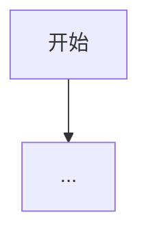

# Pattern 模板（复制此页）

> 目标：读者能在 60 秒内回答 **“我现在该不该用这个模式？”**

## 一句话（TL;DR）

用一句话写清楚：

- **模式 X =**（引入什么 loop/控制结构）**用来解决**（哪一种失败模式）。

## 你大概率需要它（症状清单）

别做“名词分类”。写 3–6 条“看到 X 就用它”的症状，例如：

- “我根本不知道要调几次工具。”
- “它一直在 loop，但没推进。”
- “我没法解释它为什么选了这个工具。”

## 解决的问题

- 从一个具体失败模式写起（“我们用了 X，然后在 Y 上翻车”）。
- 点出根因（缺观测闭环？缺验证？缺预算？缺路由？）。

## 什么时候用 / 什么时候别用

**适用：**
- （bullet）

**不适用：**
- （bullet）

## 核心流程



## 它是如何运作的（机制）

讲清楚“机制”，别只讲“感觉”：

- **State**：loop 读写哪些信息
- **控制变量**：预算、停机条件、路由条件
- **接口**：工具、动作协议、校验器
- **为什么有效**：它消灭了哪类失败模式

## 一个能对照的例子（最小）

描述一个最小可跑的例子：

- **输入**
- **过程**（loop 做了什么）
- **输出**

最好包含 10–30 行代码，或给出可运行的 `examples/` 命令。

如果可以，建议用 snippets 直接嵌入 `examples/` 源码，避免文档和代码漂移：

```python
--8<-- "examples/<nn>_<pattern>.py"
```

## 常见失败模式与对策

列出“必然会遇到”的失败，以及最小对策：

- 反复绕圈 → max steps、停滞检测
- 工具不稳定 → retry/backoff、熔断、降级
- 引用摆设 → 证据账本 + 验证

## 演化路径（它在地图上的位置）

- 建立在：哪些基建 / 早期模式上
- 常与哪些组合：哪些横切能力
- 下一步：它到头以后应该加什么

## Repo 对照

- Code：`src/agent_patterns_lab/patterns/<pattern>.py`
- Example：`examples/<nn>_<pattern>.py`
- Tests：`tests/test_<pattern>.py`

## 参考资料

- 论文 / 博客 / 文档链接（短一点就好）
