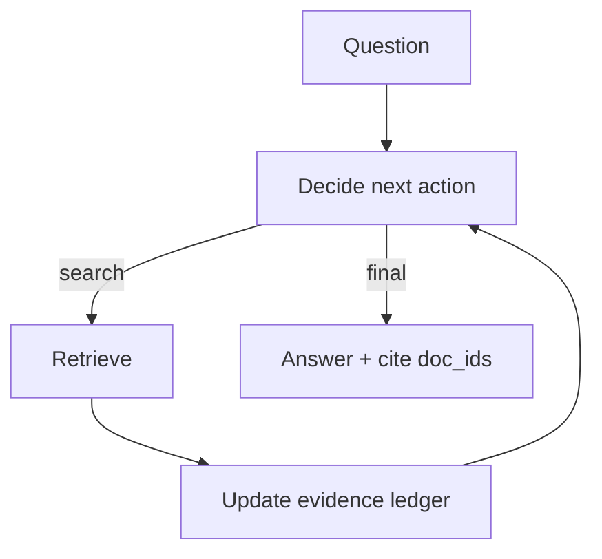

# Agentic RAG（把 RAG 做成 Agent Loop）

## 解决的问题

传统 RAG 往往是“一次检索→一次生成”。Agentic RAG 让模型动态决定：

- 何时检索
- 检索什么
- 证据是否足够
- 何时停止并作答

## 核心流程（ReAct + 检索工具 + 证据账本）

## 它是如何运作的

Agentic RAG 可以理解为“把 RAG 放进 agent loop 里”：

1. 以问题为起点，初始化一个空的 **证据账本（evidence ledger）**。
2. 每一步都要决定：
   - 要不要检索（检索什么 query？）或
   - 直接综合（证据够不够？）或
   - 停止并输出最终答案（带引用）
3. 每次检索都会更新账本：
   - 去重
   - 记录 doc_id / 使用过的片段
   - 把“证据”与“指令”隔离（防注入）
4. 最终输出把关键结论绑定到账本条目，便于审计与回归。

和 Retrieval Loop 的区别主要在“控制器”：

- Retrieval Loop 更像“检索到够用就回答”
- Agentic RAG 是更通用的 Agent：检索只是它的一种动作（还可以规划/调用其他工具/做验证）

## 常见失败模式与对策

- **检索内容注入**：把检索文本当作不可信输入；用 guardrails 做隔离与校验。
- **引用作弊**（引用了无关证据）：要求 claim→evidence 映射；对引用做验证。
- **过度检索**：预算 + early-stop；缓存 query；简单问题路由到一次性 RAG。
- **事实过期**：记录时效；对时效敏感问题触发刷新检索。

## 演化路径

- 基于：ReAct + Retrieval Loop
- 常见组合：CoVe（写完再验 claims）、Memory（沉淀经验）

## 本仓库对应

- 代码： [`src/agent_patterns_lab/patterns/agentic_rag.py`](https://github.com/lifeodyssey/agent-patterns-lab/blob/main/src/agent_patterns_lab/patterns/agentic_rag.py)
- 示例： [`examples/41_agentic_rag.py`](https://github.com/lifeodyssey/agent-patterns-lab/blob/main/examples/41_agentic_rag.py)
- 测试： [`tests/test_agentic_rag.py`](https://github.com/lifeodyssey/agent-patterns-lab/blob/main/tests/test_agentic_rag.py)
