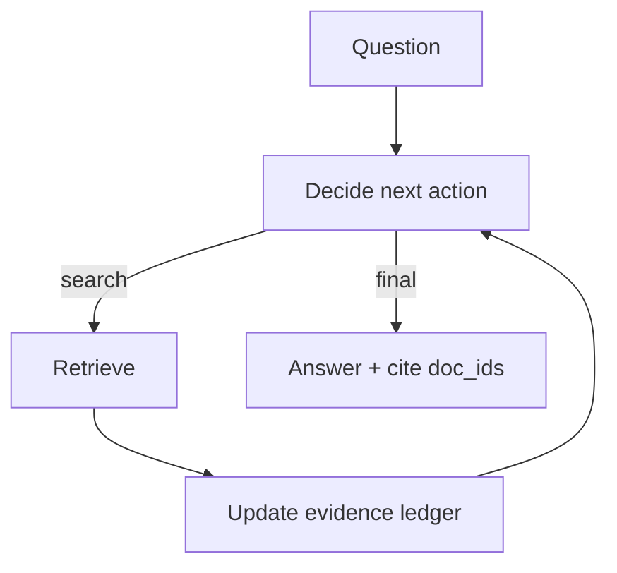

# Agentic RAG（把 RAG 做成 Agent Loop）

## 解决的问题

传统 RAG 往往是“一次检索→一次生成”。Agentic RAG 让模型动态决定：

- 何时检索
- 检索什么
- 证据是否足够
- 何时停止并作答

## 核心流程（ReAct + 检索工具 + 证据账本）

## 演化路径

- 基于：ReAct + Retrieval Loop
- 常见组合：CoVe（写完再验 claims）、Memory（沉淀经验）

## 本仓库对应

- 代码：`src/agent_patterns_lab/patterns/agentic_rag.py`
- 示例：`examples/41_agentic_rag.py`
- 测试：`tests/test_agentic_rag.py`

