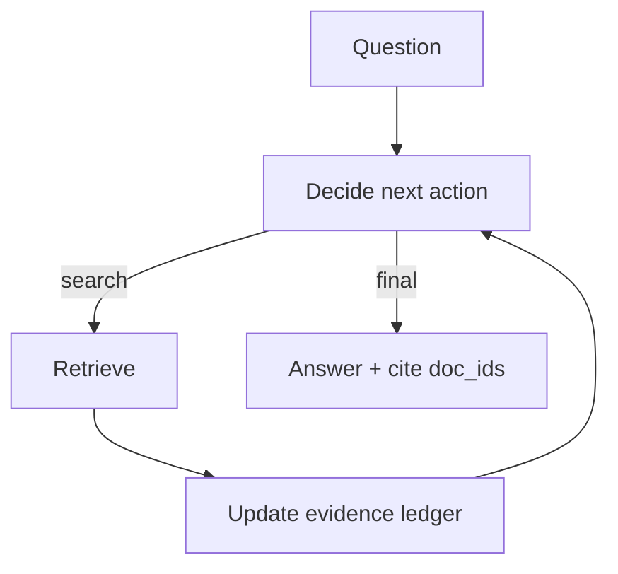

# Agentic RAG（把 RAG 做成 Agent Loop）

## 一句话（TL;DR）

Agentic RAG = **把检索放进 agent loop**：模型决定何时检、检什么、证据够不够，并用证据账本 + 停机规则把过程变得可审计。

## 你大概率需要它（症状）

- 一次性 RAG 经常答得不全，或者没法解释证据来自哪。
- 你需要多轮检索（查→读→改 query→再查）。
- 你需要“结论→证据”的可追溯链路（审计/回归）。

## 解决的问题

传统 RAG 往往是“一次检索→一次生成”。Agentic RAG 让模型动态决定：

- 何时检索
- 检索什么
- 证据是否足够
- 何时停止并作答

## 什么时候用

- 问题本身不完整，需要“边检索边收敛”。
- 你需要可审计：每条结论能追到证据（doc_id/片段）。
- 你预期检索会很脏（质量参差、可能注入、可能跑偏）。

## 什么时候别用

- 答案已经在 prompt 或小型内部知识库里 → 一次检索的 RAG 更简单更便宜。
- 你无法接受开放式 loop → 用**有界检索工作流**（固定检索次数）替代。
- 你不需要引用/溯源 → 加证据账本是负担，不是收益。

## 核心流程（ReAct + 检索工具 + 证据账本）



## 手工走一遍（一个最小例子）

问题：“What is the capital of France?”

1. 动作：先检索
   - `{"type":"tool","tool":"search","args":{"query":"capital of France","k":2}}`
2. 观测：检索返回命中的文档（带 `doc_id`）
3. 账本更新：把真正用到的证据写入 ledger（并去重）
4. 输出：尽量“从账本写答案”，并在答案里引用 `doc_id`
   - `"Paris is the capital of France. [paris]"`

## 它是如何运作的

Agentic RAG 可以理解为“把 RAG 放进 agent loop 里”：

1. 以问题为起点，初始化一个空的 **证据账本（evidence ledger）**。
2. 每一步都要决定：
   - 要不要检索（检索什么 query？）或
   - 直接综合（证据够不够？）或
   - 停止并输出最终答案（带引用）
3. 每次检索都会更新账本：
   - 去重
   - 记录 doc_id / 使用过的片段
   - 把“证据”与“指令”隔离（防注入）
4. 最终输出把关键结论绑定到账本条目，便于审计与回归。

和 Retrieval Loop 的区别主要在“控制器”：

- Retrieval Loop 更像“检索到够用就回答”
- Agentic RAG 是更通用的 Agent：检索只是它的一种动作（还可以规划/调用其他工具/做验证）

### 机制细节（让它能上线）

- **证据账本结构化**：把 evidence 存成 `{id, source, snippet, tags}`，并强制去重。
- **答案从账本写**：最终答案尽量只依赖账本条目，而不是原始页面。
- **claim ↔ evidence 映射**：要求每段/每条结论引用对应 doc_id，避免“引用摆设”。
- **工具策略**：检索文本默认不可信；进入决策环节前做隔离/过滤/guardrails。
- **预算**：限制检索次数；加收敛规则（连续 N 步没有新增证据就停）。

## 一个能对照的例子

```bash
UV_CACHE_DIR=.uv_cache PYTHONPATH=src uv run --no-sync python examples/41_agentic_rag.py
```

??? example "示例代码（`examples/41_agentic_rag.py`）"
    ```python
    --8<-- "examples/41_agentic_rag.py"
    ```

然后看 `.traces/41_agentic_rag.jsonl`，能看到每一步的检索决策与账本更新。

## 常见失败模式与对策

- **检索内容注入**：把检索文本当作不可信输入；用 guardrails 做隔离与校验。
- **引用作弊**（引用了无关证据）：要求 claim→evidence 映射；对引用做验证。
- **过度检索**：预算 + early-stop；缓存 query；简单问题路由到一次性 RAG。
- **事实过期**：记录时效；对时效敏感问题触发刷新检索。

## 演化路径

- 基于：ReAct + Retrieval Loop
- 常见组合：CoVe（写完再验 claims）、Memory（沉淀经验）

## 本仓库对应

- 代码： [`src/agent_patterns_lab/patterns/agentic_rag.py`](https://github.com/lifeodyssey/agent-patterns-lab/blob/main/src/agent_patterns_lab/patterns/agentic_rag.py)
- 示例： [`examples/41_agentic_rag.py`](https://github.com/lifeodyssey/agent-patterns-lab/blob/main/examples/41_agentic_rag.py)
- 测试： [`tests/test_agentic_rag.py`](https://github.com/lifeodyssey/agent-patterns-lab/blob/main/tests/test_agentic_rag.py)

## 参考资料

- IBM — Agentic RAG 概览：https://www.ibm.com/think/topics/agentic-rag
- GOV.UK — Agentic RAG（风险与注意事项）：https://www.gov.uk/government/publications/ai-insights/ai-insights-agentic-rag-html
- ExploreAgentic — Agentic RAG 术语解释风格：https://exploreagentic.ai/glossary/agentic-rag/
