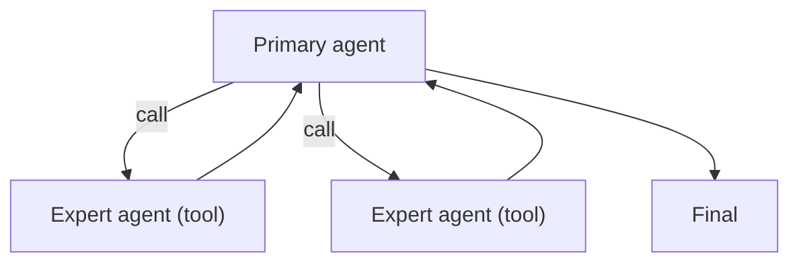

# Agents-as-Tools（把子 Agent 当工具）

## 解决的问题

你想复用专家 agent，但不想把控制权交出去。Agents-as-Tools 保持**单一主控**，把专家 agent 当 tool 调用。

## 核心流程

## 它是如何运作的

把每个子 agent 当作“带契约的能力”：

- **名字**：擅长什么（research / coder / critic…）
- **Args**：输入任务的 schema
- **Observation**：子 agent 输出的结构化结果，便于主控消费

主控 agent 负责全局上下文、记忆与最终汇总；子 agent 只做窄范围任务。

## 常见失败模式与对策

- **子 agent 失控**（跑太久）：给每个 agent 单独预算；限制最大轮次。
- **责任不清**：要求子 agent 给证据/检查清单；输出可验证结果。
- **上下文泄露**（传太多信息）：只传必要上下文。
- **“工具汤”**（agent 太多）：加 routing；只保留高收益专家 agent。

## 演化路径

- 基于 tool calling 的“显式协议”
- 常与 policy/guardrails 搭配（限制子 agent 的权限）

## 本仓库对应

- 代码： [`src/agent_patterns_lab/patterns/agents_as_tools.py`](https://github.com/lifeodyssey/agent-patterns-lab/blob/main/src/agent_patterns_lab/patterns/agents_as_tools.py)
- 示例： [`examples/61_agents_as_tools.py`](https://github.com/lifeodyssey/agent-patterns-lab/blob/main/examples/61_agents_as_tools.py)
- 测试： [`tests/test_agents_as_tools.py`](https://github.com/lifeodyssey/agent-patterns-lab/blob/main/tests/test_agents_as_tools.py)
