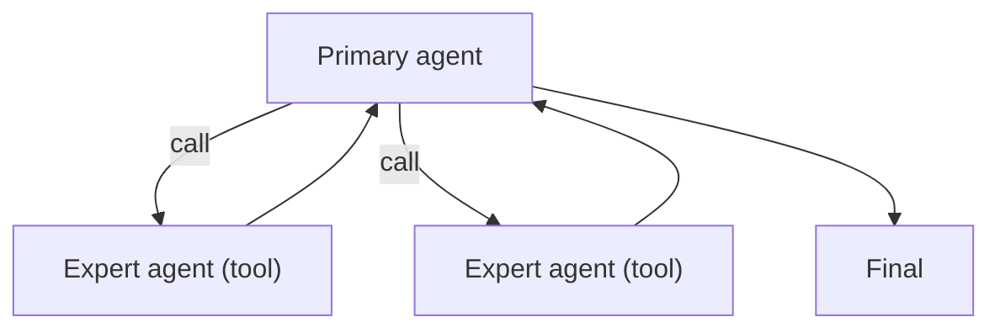

# Agents-as-Tools（把子 Agent 当工具）

## 解决的问题

你想复用专家 agent，但不想把控制权交出去。Agents-as-Tools 保持**单一主控**，把专家 agent 当 tool 调用。

## 什么时候用

- 需要专家分工，但最终输出需要一个“owner”统一把控。
- 希望子 agent 可替换、可收敛（输入输出契约清晰，范围受控）。
- 想在“调用边界”上挂治理（policy/guardrails）。

## 什么时候别用

- 你希望被接手的 agent 继续对话并对结果负责 → 用 **handoff**。
- 你需要看见子 agent 的中间工具调用与过程 → 用 **manager-worker** + tracing 更合适。
- 子任务是确定性的、范围很小 → 普通工具/函数就够，不必上子 agent。

## 核心流程



## 它是如何运作的

把每个子 agent 当作“带契约的能力”：

- **名字**：擅长什么（research / coder / critic…）
- **Args**：输入任务的 schema
- **Observation**：子 agent 输出的结构化结果，便于主控消费

主控 agent 负责全局上下文、记忆与最终汇总；子 agent 只做窄范围任务。

### 机制细节（把边界守住）

- **子 agent prompt 要窄**：一个角色、一组工具、一种输出 schema。
- **I/O 类型化**：把子 agent 当 API，用解析/校验接住输出再消费。
- **最小上下文**：只把子 agent 需要的片段传进去，别把整段历史 dump 过去。
- **分 agent 预算**：限制每个子 agent 的 turns/steps，避免一个子 agent 吃掉整次运行预算。

## 一个能对照的例子

```bash
UV_CACHE_DIR=.uv_cache PYTHONPATH=src uv run --no-sync python examples/61_agents_as_tools.py
```

## 常见失败模式与对策

- **子 agent 失控**（跑太久）：给每个 agent 单独预算；限制最大轮次。
- **责任不清**：要求子 agent 给证据/检查清单；输出可验证结果。
- **上下文泄露**（传太多信息）：只传必要上下文。
- **“工具汤”**（agent 太多）：加 routing；只保留高收益专家 agent。

## 演化路径

- 基于 tool calling 的“显式协议”
- 常与 policy/guardrails 搭配（限制子 agent 的权限）

## 本仓库对应

- 代码： [`src/agent_patterns_lab/patterns/agents_as_tools.py`](https://github.com/lifeodyssey/agent-patterns-lab/blob/main/src/agent_patterns_lab/patterns/agents_as_tools.py)
- 示例： [`examples/61_agents_as_tools.py`](https://github.com/lifeodyssey/agent-patterns-lab/blob/main/examples/61_agents_as_tools.py)
- 测试： [`tests/test_agents_as_tools.py`](https://github.com/lifeodyssey/agent-patterns-lab/blob/main/tests/test_agents_as_tools.py)

## 参考资料

- Microsoft Agent Framework — Agents as Tools：https://learn.microsoft.com/en-us/agent-framework/journey/agents-as-tools
- Microsoft Agent Framework — Handoff（对比 agent-as-tool）：https://learn.microsoft.com/en-us/agent-framework/user-guide/workflows/orchestrations/handoff
