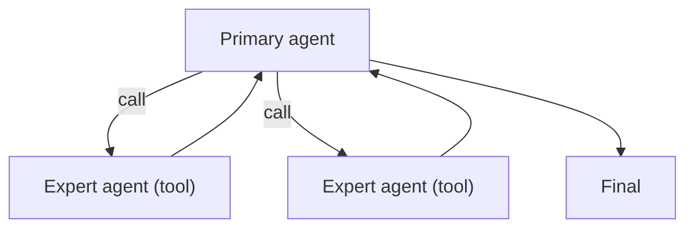

# Agents-as-Tools（把子 Agent 当工具）

## 解决的问题

你想复用专家 agent，但不想把控制权交出去。Agents-as-Tools 保持**单一主控**，把专家 agent 当 tool 调用。

## 核心流程

## 演化路径

- 基于 tool calling 的“显式协议”
- 常与 policy/guardrails 搭配（限制子 agent 的权限）

## 本仓库对应

- 代码：`src/agent_patterns_lab/patterns/agents_as_tools.py`
- 示例：`examples/61_agents_as_tools.py`
- 测试：`tests/test_agents_as_tools.py`

