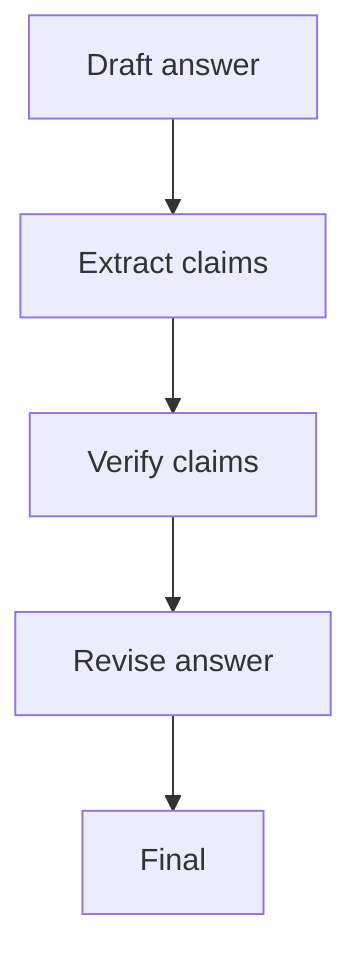

# CoVe（Chain-of-Verification）

## 解决的问题

“听起来对”不等于“事实对”。CoVe 把验证变成一等公民：

1. draft
2. 抽取可验证 claims
3. 逐条验证（工具/规则/人工）
4. 基于验证结果修订

## 什么时候用

- 你真的在乎事实正确性（不仅是“看起来合理”）。
- 输出里有多个可验证 claim（清单、对比、“X 是 Y”这类断言）。
- 你有验证手段（检索/工具/规则/HITL 至少一种）。

## 什么时候别用

- 你根本没法验证（没工具、没来源、也没人能 review）→ CoVe 只剩仪式感。
- 任务是纯创意写作（小说、文案气质），“事实”不是目标。
- 输出很短且低风险 → 简单重试或 Maker-Checker 可能更便宜。

## 核心流程



## 它是如何运作的

核心思路是：把“验证”拆成独立工作流，而不是一句“请核对一下”：

- **Claim 抽取**：把自由文本的 draft 转成“可检查条目列表”。
  - 好的 claim 要具体、可测试，并且有明确的通过/失败条件
- **逐条验证**：对每条 claim 用证据去验证：
  - 检索/搜索
  - 确定性校验（数学、单位换算、约束检查）
  - 高风险走人工审批（HITL）
- **基于证据修订**：把不支持的 claim 删除/改写，最后只留下能自证的内容。

### 机制细节（区别于“再读一遍”）

- **claim 原子化**：把断言拆到“可独立检查”的颗粒度。
- **证据产物**：验证步骤必须输出证据（doc_id/snippet/计算），不能只说“我觉得对”。
- **抗锚定**：验证时尽量不要被 draft 的措辞带偏（可以用“验证问题→独立回答”的方式）。
- **选择性验证**：别全验；优先验高风险、对外展示、最容易出错的断言。

## 一个能对照的例子

```bash
UV_CACHE_DIR=.uv_cache PYTHONPATH=src uv run --no-sync python examples/32_cove.py
```

## 常见失败模式与对策

- **漏掉 claim**：强制结构化 claim 列表；必要时二次抽取。
- **验证太弱**（靠“看起来像真”）：要求证据产物（doc_id、引用片段、计算过程）。
- **验证成本过高**：只验证高风险 claim；对简单问题路由到轻量流程。
- **证据过期**：对时效敏感问题记录来源时间戳，必要时刷新验证。

## 演化路径

- 相比 Maker-Checker 更聚焦“事实 claim”
- 常与 Retrieval/Agentic RAG 搭配（先补证据再验证）

## 本仓库对应

- 代码： [`src/agent_patterns_lab/patterns/cove.py`](https://github.com/lifeodyssey/agent-patterns-lab/blob/main/src/agent_patterns_lab/patterns/cove.py)
- 示例： [`examples/32_cove.py`](https://github.com/lifeodyssey/agent-patterns-lab/blob/main/examples/32_cove.py)
- 测试： [`tests/test_cove.py`](https://github.com/lifeodyssey/agent-patterns-lab/blob/main/tests/test_cove.py)

## 参考资料

- Dhuliawala 等（2023）：Chain-of-Verification（CoVe）https://arxiv.org/abs/2309.11495
