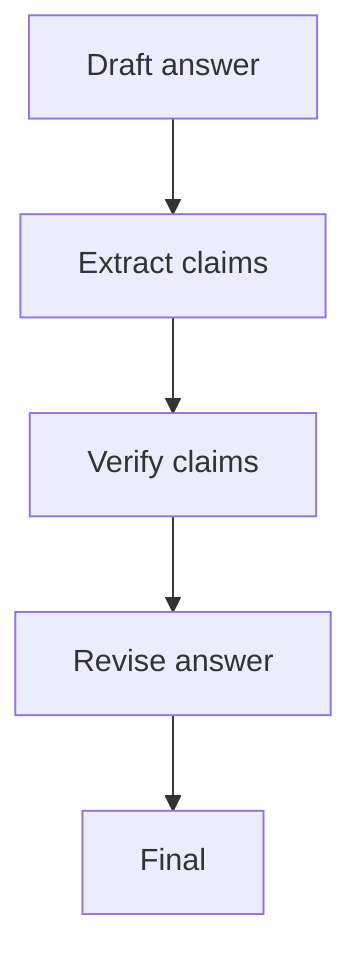

# CoVe（Chain-of-Verification）

## 解决的问题

“听起来对”不等于“事实对”。CoVe 把验证变成一等公民：

1. draft
2. 抽取可验证 claims
3. 逐条验证（工具/规则/人工）
4. 基于验证结果修订

## 核心流程

## 演化路径

- 相比 Maker-Checker 更聚焦“事实 claim”
- 常与 Retrieval/Agentic RAG 搭配（先补证据再验证）

## 本仓库对应

- 代码：`src/agent_patterns_lab/patterns/cove.py`
- 示例：`examples/32_cove.py`
- 测试：`tests/test_cove.py`

