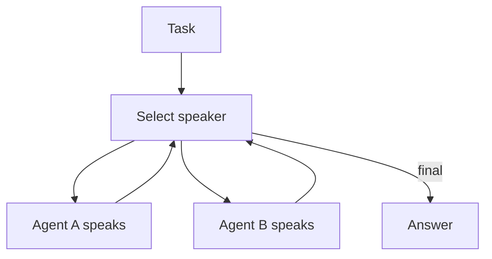

# Group Chat / Council / Debate（圆桌协作/辩论）

## 解决的问题

很多错误只有在“被质疑”时才暴露。Group chat 引入多视角与辩论机制，通过发言策略推动收敛。

## 两种常见调度

- **Round-robin**：固定轮流发言。
- **Selector**：由 selector 模型选择下一位发言者。

## 核心流程（Selector）

## 它是如何运作的

Group chat 的核心是：多个 agent 在同一对话空间内交互，但要有明确的“对话政策”：

- **发言者**：有明确角色差异（critic / planner / implementer / safety…）
- **调度**：谁下一位发言（轮询、selector、主持人）
- **终止条件**：什么时候停止争论，进入最终汇总

适用于：

- 需要通过质疑/辩论暴露隐蔽错误
- 需要把多个部分洞见整合成更好的答案

## 常见失败模式与对策

- **回音室**：强制角色多样性；指定 devil’s advocate。
- **不收敛**：引入主持人；定义决策规则（投票、rubric、manager 汇总）。
- **成本爆炸**：限制轮次；只把高风险任务路由到 group chat。
- **输出互相矛盾**：要求结构化 claim + evidence；增加 merge/一致性检查。

## 演化路径

- 与 manager-worker 同属多智能体编排，但更偏“同侪协作”
- 常配合验证（CoVe）与 eval（控制成本/回归）

## 本仓库对应

- 代码： [`src/agent_patterns_lab/patterns/group_chat.py`](https://github.com/lifeodyssey/agent-patterns-lab/blob/main/src/agent_patterns_lab/patterns/group_chat.py)
- 示例：[`examples/62_group_chat_round_robin.py`](https://github.com/lifeodyssey/agent-patterns-lab/blob/main/examples/62_group_chat_round_robin.py)、[`examples/63_group_chat_selector.py`](https://github.com/lifeodyssey/agent-patterns-lab/blob/main/examples/63_group_chat_selector.py)
- 测试： [`tests/test_group_chat.py`](https://github.com/lifeodyssey/agent-patterns-lab/blob/main/tests/test_group_chat.py)
