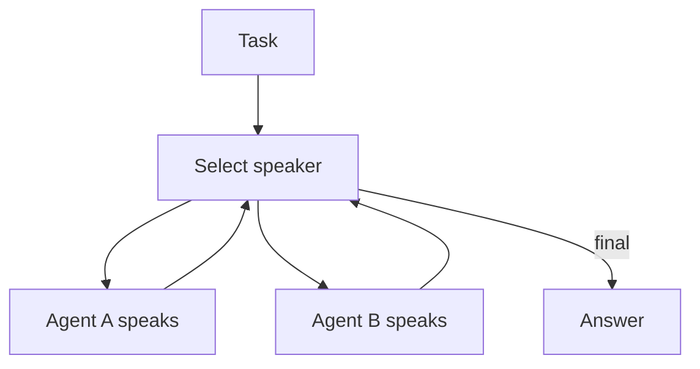

# Group Chat / Council / Debate（圆桌协作/辩论）

## 解决的问题

很多错误只有在“被质疑”时才暴露。Group chat 引入多视角与辩论机制，通过发言策略推动收敛。

## 两种常见调度

- **Round-robin**：固定轮流发言。
- **Selector**：由 selector 模型选择下一位发言者。

## 核心流程（Selector）

## 演化路径

- 与 manager-worker 同属多智能体编排，但更偏“同侪协作”
- 常配合验证（CoVe）与 eval（控制成本/回归）

## 本仓库对应

- 代码：`src/agent_patterns_lab/patterns/group_chat.py`
- 示例：`examples/62_group_chat_round_robin.py`、`examples/63_group_chat_selector.py`
- 测试：`tests/test_group_chat.py`

