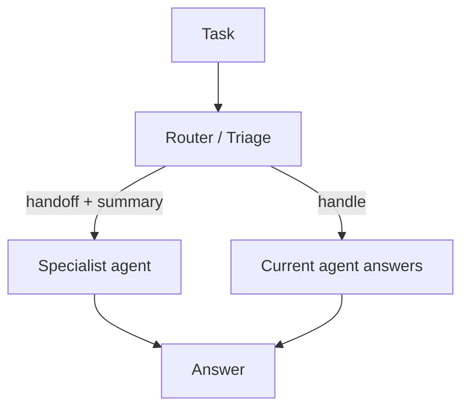

# Handoff（分诊 / 升级）

## 解决的问题

当前 agent 可能不是最佳“负责人”：

- 专长不匹配
- 权限/工具不匹配
- 风险级别不匹配

Handoff 把升级变得显式：**交接给谁 + 交接摘要**。

## 核心流程

## 它是如何运作的

高质量 handoff 的关键是 **短而结构化的交接摘要**：

- 用户意图与约束
- 已尝试过什么
- 关键产物（链接/文件/中间结果）
- 未决问题与下一步动作

这样 specialist agent 可以快速接手，而不是从头读完整对话。

## 常见失败模式与对策

- **上下文丢失**：统一 handoff summary schema；确保关键产物齐全。
- **来回踢皮球**：明确 ownership；限制 handoff 深度；必要时引入 manager 仲裁。
- **绕过权限**：与 policy/guardrails 结合，handoff 不能变相提权。
- **过度交接**：只有在低置信或“错的代价很高”时才 handoff。

## 演化路径

- 属于“在 agent 间 routing”的模式（与 manager-worker 很搭）
- 常与治理结合：不同 agent 具备不同权限

## 本仓库对应

- 代码： [`src/agent_patterns_lab/patterns/handoff.py`](https://github.com/lifeodyssey/agent-patterns-lab/blob/main/src/agent_patterns_lab/patterns/handoff.py)
- 示例： [`examples/64_handoff.py`](https://github.com/lifeodyssey/agent-patterns-lab/blob/main/examples/64_handoff.py)
- 测试： [`tests/test_handoff_pattern.py`](https://github.com/lifeodyssey/agent-patterns-lab/blob/main/tests/test_handoff_pattern.py)
