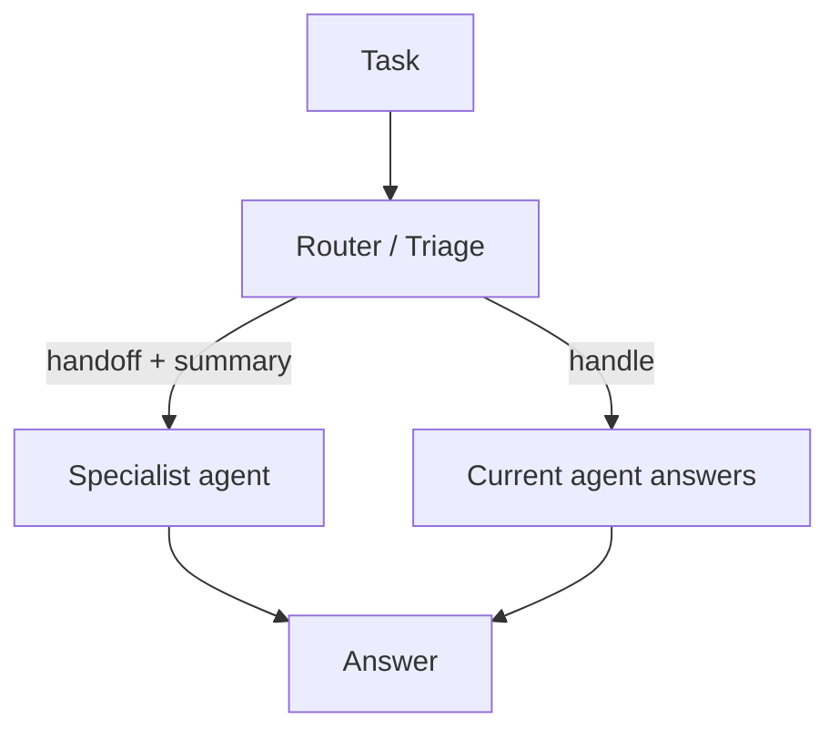

# Handoff（分诊 / 升级）

## 解决的问题

当前 agent 可能不是最佳“负责人”：

- 专长不匹配
- 权限/工具不匹配
- 风险级别不匹配

Handoff 把升级变得显式：**交接给谁 + 交接摘要**。

## 核心流程

## 演化路径

- 属于“在 agent 间 routing”的模式（与 manager-worker 很搭）
- 常与治理结合：不同 agent 具备不同权限

## 本仓库对应

- 代码：`src/agent_patterns_lab/patterns/handoff.py`
- 示例：`examples/64_handoff.py`
- 测试：`tests/test_handoff_pattern.py`

