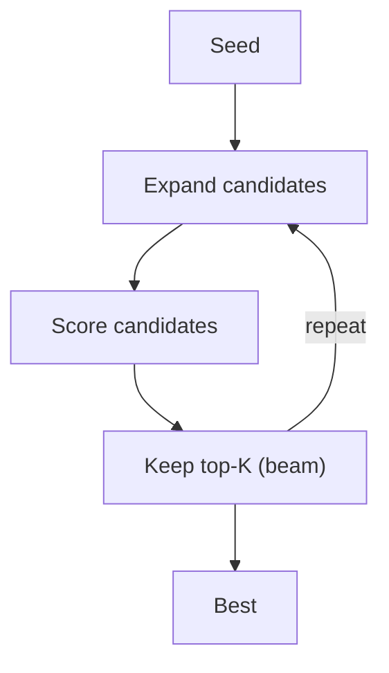

# LATS（树/束搜索）

## 解决的问题

把“推理/解答”当成一个搜索空间，可以通过：

- 扩展候选
- 评分
- 保留 top-K
- 重复迭代

## 核心流程

## 它是如何运作的

把候选解当作搜索树节点：

1. 从一个 seed 解法（或部分计划）开始。
2. **Expand**：生成多个变体（不同推理路径/不同工具策略）。
3. **Score**：用 rubric、测试、工具校验来给候选打分。
4. 保留 top-K（beam），在预算内重复迭代。

它适用于：单条推理链不稳定，但“评估/校验”相对可行的场景。

## 常见失败模式与对策

- **组合爆炸**：限制深度/分支/总节点数；用 beam search 控制规模。
- **评估器偏差**：多指标打分；尽量引入确定性校验（测试/工具）。
- **刷分**：让 scorer 规则显式；用独立信号交叉验证。
- **成本太高**：只把难样本路由进 LATS；缓存中间结果。

## 演化路径

- 与 plan 类方法互补（Plan & Solve / PER）
- 很依赖 evaluator（rubric/unit test/tool）

## 本仓库对应

- 代码： [`src/agent_patterns_lab/patterns/lats.py`](https://github.com/lifeodyssey/agent-patterns-lab/blob/main/src/agent_patterns_lab/patterns/lats.py)
- 示例： [`examples/54_lats.py`](https://github.com/lifeodyssey/agent-patterns-lab/blob/main/examples/54_lats.py)
- 测试： [`tests/test_lats.py`](https://github.com/lifeodyssey/agent-patterns-lab/blob/main/tests/test_lats.py)
