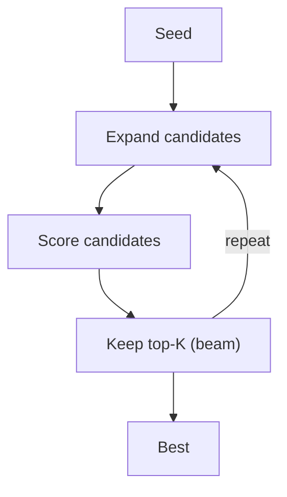

# LATS（树/束搜索）

## 解决的问题

把“推理/解答”当成一个搜索空间，可以通过：

- 扩展候选
- 评分
- 保留 top-K
- 重复迭代

## 核心流程

## 演化路径

- 与 plan 类方法互补（Plan & Solve / PER）
- 很依赖 evaluator（rubric/unit test/tool）

## 本仓库对应

- 代码：`src/agent_patterns_lab/patterns/lats.py`
- 示例：`examples/54_lats.py`
- 测试：`tests/test_lats.py`

