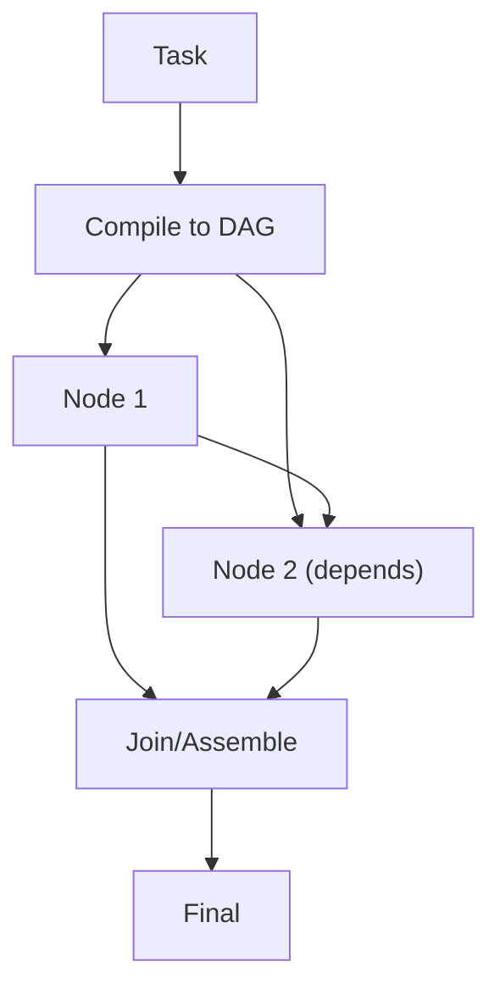

# LLM Compiler（编译为 DAG）

## 解决的问题

有些任务存在显式依赖关系、可以并行。LLM Compiler：

- 把计划“编译”为 DAG（节点 + 依赖）
- 拓扑执行
- 最后 assemble

## 核心流程

## 它是如何运作的

LLM Compiler 的关键是把执行结构外化：

1. **Compile**：模型产出 DAG 规格：
   - 节点 id / 描述
   - 输入/输出
   - 依赖关系
2. **Execute**：按拓扑顺序执行节点（独立节点可并行）。
3. **Join**：把节点输出组装为最终产物（报告/代码/结论）。

相对线性计划的优势是：并行 + 依赖可追踪。

## 常见失败模式与对策

- **依赖画错**：增加“图审查”步骤；强制 schema 与不变量。
- **出现环/非法图**：DAG 校验；必要时降级为线性执行。
- **Join 丢上下文**：每节点固定输出 schema；保留摘要与引用。
- **非确定性难回归**：缓存节点输出；在 DAG 级别做 eval。

## 演化路径

- Plan & Solve 的图执行版本（明确依赖）
- 与 cache/eval 很搭：图回归往往更隐蔽

## 本仓库对应

- 代码： [`src/agent_patterns_lab/patterns/llm_compiler.py`](https://github.com/lifeodyssey/agent-patterns-lab/blob/main/src/agent_patterns_lab/patterns/llm_compiler.py)
- 示例： [`examples/53_llm_compiler.py`](https://github.com/lifeodyssey/agent-patterns-lab/blob/main/examples/53_llm_compiler.py)
- 测试： [`tests/test_llm_compiler.py`](https://github.com/lifeodyssey/agent-patterns-lab/blob/main/tests/test_llm_compiler.py)
