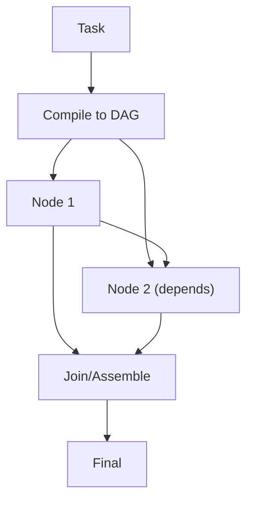

# LLM Compiler（编译为 DAG）

## 解决的问题

有些任务存在显式依赖关系、可以并行。LLM Compiler：

- 把计划“编译”为 DAG（节点 + 依赖）
- 拓扑执行
- 最后 assemble

## 核心流程

## 演化路径

- Plan & Solve 的图执行版本（明确依赖）
- 与 cache/eval 很搭：图回归往往更隐蔽

## 本仓库对应

- 代码：`src/agent_patterns_lab/patterns/llm_compiler.py`
- 示例：`examples/53_llm_compiler.py`
- 测试：`tests/test_llm_compiler.py`

