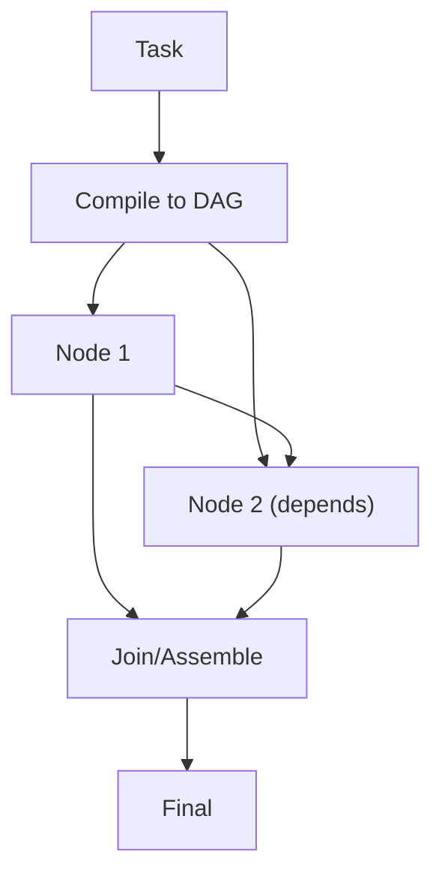

# LLM Compiler（编译为 DAG）

## 解决的问题

有些任务存在显式依赖关系、可以并行。LLM Compiler：

- 把计划“编译”为 DAG（节点 + 依赖）
- 拓扑执行
- 最后 assemble

## 什么时候用

- 任务天然是“有依赖的子任务集合”（更像图，而不是线性清单）。
- 你想并行执行独立节点，缩短总耗时。
- 你希望每个节点都有清晰产物，方便 debug 与 eval。

## 什么时候别用

- 你只有 1–3 个工具调用，也没啥并行 → workflow / REWOO 更省事。
- 依赖必须等观测出来才知道 → PER 或 ReAct 更合适。
- 工具有副作用且强顺序敏感 → 并行执行容易踩坑。

## 核心流程



## 它是如何运作的

LLM Compiler 的关键是把执行结构外化：

1. **Compile**：模型产出 DAG 规格：
   - 节点 id / 描述
   - 输入/输出
   - 依赖关系
2. **Execute**：按拓扑顺序执行节点（独立节点可并行）。
3. **Join**：把节点输出组装为最终产物（报告/代码/结论）。

相对线性计划的优势是：并行 + 依赖可追踪。

### 机制细节（哪些必须校验）

- **DAG schema**：节点至少要有 `id / tool / args / deps / outputs`。
- **图不变量**：必须无环；依赖必须存在；参数引用必须能解析到上游输出。
- **执行策略**：拓扑排序 + 有界并行；对单节点失败要有“部分结果/降级”策略。
- **Join 契约**：Join 只读“节点输出”，别把整段工具日志塞回去（会爆上下文）。

## 一个能对照的例子

```bash
UV_CACHE_DIR=.uv_cache PYTHONPATH=src uv run --no-sync python examples/53_llm_compiler.py
```

## 常见失败模式与对策

- **依赖画错**：增加“图审查”步骤；强制 schema 与不变量。
- **出现环/非法图**：DAG 校验；必要时降级为线性执行。
- **Join 丢上下文**：每节点固定输出 schema；保留摘要与引用。
- **非确定性难回归**：缓存节点输出；在 DAG 级别做 eval。

## 演化路径

- Plan & Solve 的图执行版本（明确依赖）
- 与 cache/eval 很搭：图回归往往更隐蔽

## 本仓库对应

- 代码： [`src/agent_patterns_lab/patterns/llm_compiler.py`](https://github.com/lifeodyssey/agent-patterns-lab/blob/main/src/agent_patterns_lab/patterns/llm_compiler.py)
- 示例： [`examples/53_llm_compiler.py`](https://github.com/lifeodyssey/agent-patterns-lab/blob/main/examples/53_llm_compiler.py)
- 测试： [`tests/test_llm_compiler.py`](https://github.com/lifeodyssey/agent-patterns-lab/blob/main/tests/test_llm_compiler.py)

## 参考资料

- Kim 等（2023）：An LLM Compiler for Parallel Function Calling：https://arxiv.org/abs/2312.04511
- Agent Patterns — LLM Compiler pattern page：https://agent-patterns.readthedocs.io/en/stable/patterns/llm-compiler.html
