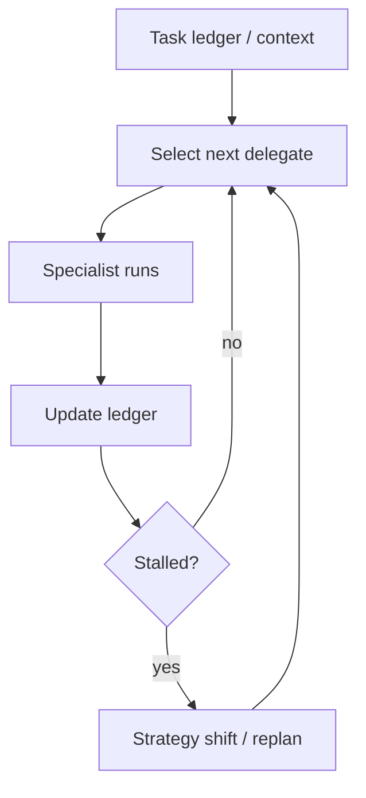

# Magentic（任务账本 + 停滞检测）

## 解决的问题

开放域任务中，固定拆解很脆。Magentic 风格编排强调：

- 任务账本（这里用 messages 隐式表达）
- 动态委派给 specialist
- 停滞检测（重复委派同一件事则触发策略切换）

## 核心流程

## 演化路径

- 泛化 manager-worker：从“固定派工”变为“动态派工”
- 强依赖 tracing/governance/eval，否则更易漂移

## 本仓库对应

- 代码：`src/agent_patterns_lab/patterns/magentic_orchestration.py`
- 示例：`examples/65_magentic_orchestration.py`
- 测试：`tests/test_magentic_orchestration.py`

