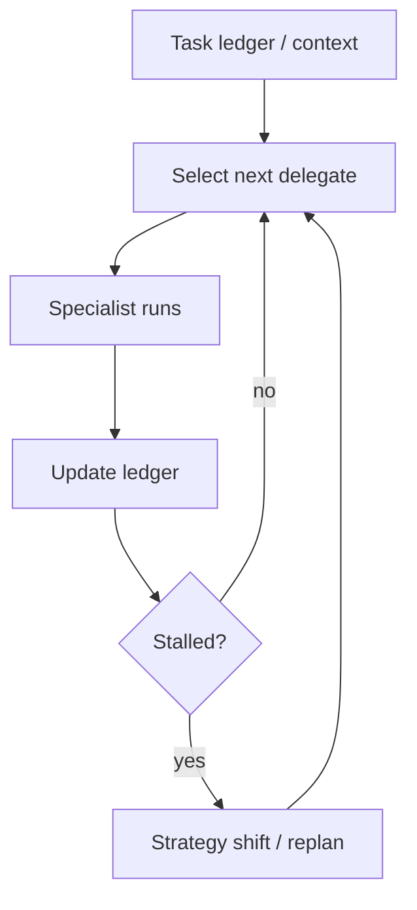

# Magentic（任务账本 + 停滞检测）

## 解决的问题

开放域任务中，固定拆解很脆。Magentic 风格编排强调：

- 任务账本（这里用 messages 隐式表达）
- 动态委派给 specialist
- 停滞检测（重复委派同一件事则触发策略切换）

## 什么时候用

- 开放式任务，“一口气规划完”很可能会错。
- 你需要显式进展追踪（任务账本 + 产物）。
- 你预期会停滞，需要能触发策略切换/重规划。

## 什么时候别用

- 解法路径是确定性的 → workflow 或 manager-worker 更便宜、更好测。
- 你并不需要账本/进展追踪 → 别为“可解释性”付冤枉钱。
- 任务非常赶时间 → Magentic 会花 token 在规划与协调上。

## 核心流程



## 它是如何运作的

Magentic 风格把**任务账本（task ledger）**放在中心：

- 任务/子任务 + 状态（todo/doing/done）
- 假设与关键决策
- 产物（笔记、引用、代码指针）
- 预算（时间、工具次数、成本）

每一轮循环：

1. 基于账本缺口选择下一位 delegate/角色。
2. Specialist 带着窄目标执行。
3. 把结果写回账本。
4. 做停滞检测（没有新进展）并触发策略切换/重规划。

### 机制细节（区别于“随便多智能体”）

- **账本是事实源**：manager 读写结构化 ledger，而不是只靠聊天记录。
- **进展证据**：每轮必须产生新产物（笔记/决策/代码/验证结论），否则记为“无进展”。
- **停滞规则**：重复同一工具/同一 agent、无新产物、计划来回摆动等。
- **策略切换**：停滞后必须换打法（重拆解/换工具/拉人审批/收缩目标）。

## 一个能对照的例子

```bash
UV_CACHE_DIR=.uv_cache PYTHONPATH=src uv run --no-sync python examples/65_magentic_orchestration.py
```

## 常见失败模式与对策

- **账本漂移**：账本 schema 要小；更新必须具体、可验证。
- **停滞误判**：调停滞规则（重复动作/无新产物）；允许人工 override。
- **无限委派**：限制总轮次；要求每轮提供“进展证据”。
- **安全漏洞**：与 policy/guardrails 结合，委派不能绕过约束。

## 演化路径

- 泛化 manager-worker：从“固定派工”变为“动态派工”
- 强依赖 tracing/governance/eval，否则更易漂移

## 本仓库对应

- 代码： [`src/agent_patterns_lab/patterns/magentic_orchestration.py`](https://github.com/lifeodyssey/agent-patterns-lab/blob/main/src/agent_patterns_lab/patterns/magentic_orchestration.py)
- 示例： [`examples/65_magentic_orchestration.py`](https://github.com/lifeodyssey/agent-patterns-lab/blob/main/examples/65_magentic_orchestration.py)
- 测试： [`tests/test_magentic_orchestration.py`](https://github.com/lifeodyssey/agent-patterns-lab/blob/main/tests/test_magentic_orchestration.py)

## 参考资料

- Azure Architecture Center — Magentic orchestration：https://learn.microsoft.com/en-us/azure/architecture/ai-ml/guide/ai-agent-design-patterns
- Microsoft Agent Framework — Magentic orchestration：https://learn.microsoft.com/en-us/agent-framework/user-guide/workflows/orchestrations/magentic
- Fourney 等（2024）：Magentic-One：https://arxiv.org/abs/2411.04468
