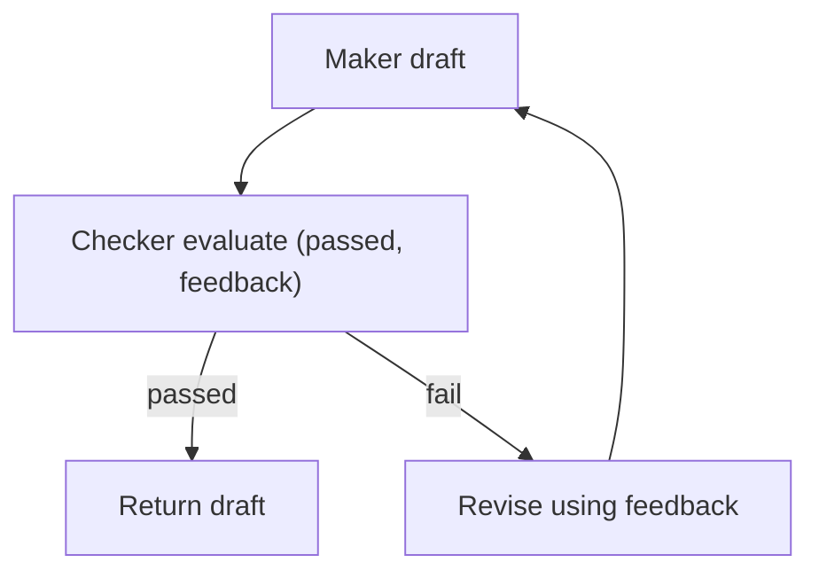

# Maker-Checker（Evaluator-Optimizer）

## 解决的问题

生成草稿并不等于可交付。很多任务都需要一个“质量门”：

- 正确性 rubric
- 安全要求
- 格式约束

Maker-Checker 把“验证 + 反馈 + 修订”变成显式 loop。

## 什么时候用

- 错误代价高（生产事故/安全风险/财务损失）。
- 能写清楚 **rubric**（什么叫“通过/不通过”）。
- 你想要可复现的质量提升，而不是“多试几次”。

## 核心流程

## 它是如何运作的

1. **Maker** 先产出草稿。
2. **Checker** 按 rubric 评估并输出：
   - `passed: true/false`
   - 具体反馈（哪里错、怎么改）
3. 如果不通过，Maker 按反馈修订并重复。

关键点在于：Checker 的输出要 **结构化 + 可执行**，否则修订环节会变成“瞎改”。

## 常见失败模式与对策

- **Maker/Checker “串谋”**：用不同 prompt/温度/甚至不同模型做 checker。
- **反馈太虚**：强制 Checker 输出可验证、可定位的问题条目。
- **无限修订**：设最大轮次 + “够好即可”阈值。
- **成本失控**：缓存 checker 结果；收紧 rubric；更早 early-stop。

## 演化路径

- 来源：单次生成
- 常见组合：Voting / CoVe / Retrieval

## 本仓库对应

- 代码： [`src/agent_patterns_lab/patterns/maker_checker.py`](https://github.com/lifeodyssey/agent-patterns-lab/blob/main/src/agent_patterns_lab/patterns/maker_checker.py)
- 示例： [`examples/30_maker_checker.py`](https://github.com/lifeodyssey/agent-patterns-lab/blob/main/examples/30_maker_checker.py)
- 测试： [`tests/test_maker_checker.py`](https://github.com/lifeodyssey/agent-patterns-lab/blob/main/tests/test_maker_checker.py)
