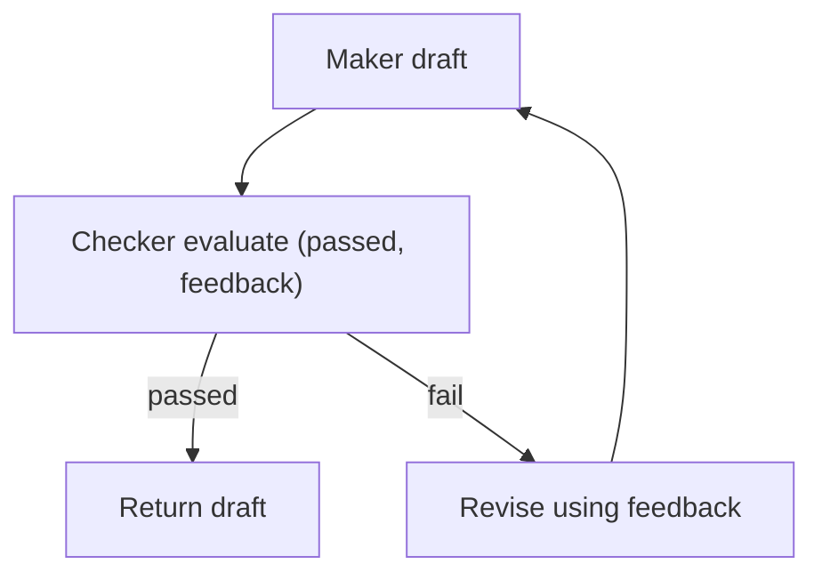

# Maker-Checker（Evaluator-Optimizer）

## 解决的问题

生成草稿并不等于可交付。很多任务都需要一个“质量门”：

- 正确性 rubric
- 安全要求
- 格式约束

Maker-Checker 把“验证 + 反馈 + 修订”变成显式 loop。

## 核心流程

## 演化路径

- 来源：单次生成
- 常见组合：Voting / CoVe / Retrieval

## 本仓库对应

- 代码：`src/agent_patterns_lab/patterns/maker_checker.py`
- 示例：`examples/30_maker_checker.py`
- 测试：`tests/test_maker_checker.py`

