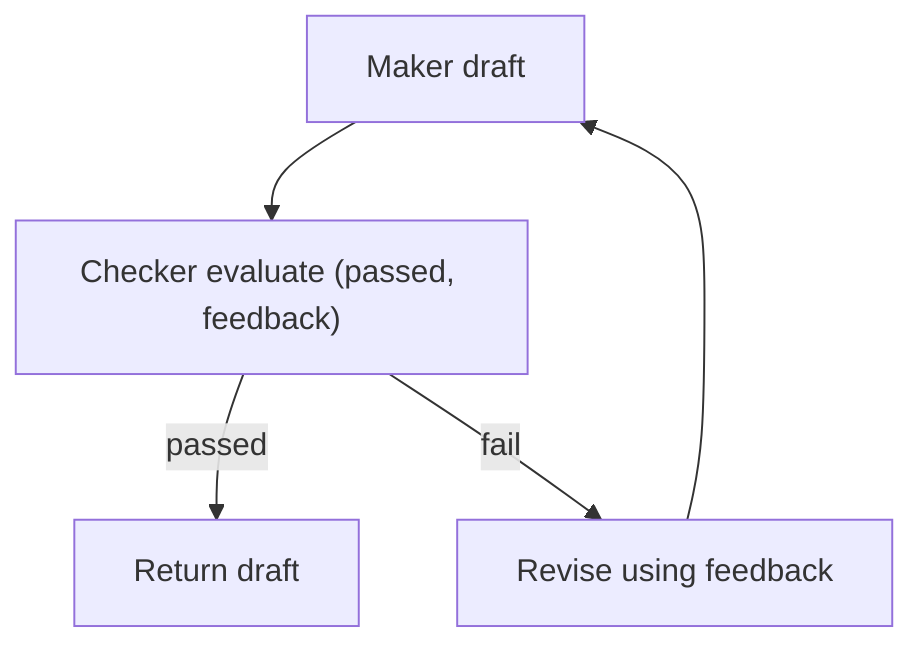

# Maker-Checker（Evaluator-Optimizer）

## 解决的问题

生成草稿并不等于可交付。很多任务都需要一个“质量门”：

- 正确性 rubric
- 安全要求
- 格式约束

Maker-Checker 把“验证 + 反馈 + 修订”变成显式 loop。

## 什么时候用

- 错误代价高（生产事故/安全风险/财务损失）。
- 能写清楚 **rubric**（什么叫“通过/不通过”）。
- 你想要可复现的质量提升，而不是“多试几次”。

## 什么时候别用

- 你有**确定性的校验器**（单测、schema、规则）能抓住问题 → 先用确定性校验。
- checker 也判断不出来好坏（没 rubric、没可验证信号）→ loop 会变成“自己骗自己”。
- 低风险、强延迟约束的场景 → 多一轮就是多一笔成本。

## 核心流程



## 它是如何运作的

1. **Maker** 先产出草稿。
2. **Checker** 按 rubric 评估并输出：
   - `passed: true/false`
   - 具体反馈（哪里错、怎么改）
3. 如果不通过，Maker 按反馈修订并重复。

关键点在于：Checker 的输出要 **结构化 + 可执行**，否则修订环节会变成“瞎改”。

### 机制细节（让它真的起作用）

- **rubric 是契约**：把“通过/不通过”绑定到具体条目，而不是“感觉更好”。
- **角色隔离**：Maker/Checker 用不同 prompt（必要时不同模型）减少回音室效应。
- **预算**：限制修订轮次；明确“够好即可”的阈值。
- **外部校验优先**：能用工具/规则做 check 就别让 LLM 当裁判。

## 一个能对照的例子

```bash
UV_CACHE_DIR=.uv_cache PYTHONPATH=src uv run --no-sync python examples/30_maker_checker.py
```

## 常见失败模式与对策

- **Maker/Checker “串谋”**：用不同 prompt/温度/甚至不同模型做 checker。
- **反馈太虚**：强制 Checker 输出可验证、可定位的问题条目。
- **无限修订**：设最大轮次 + “够好即可”阈值。
- **成本失控**：缓存 checker 结果；收紧 rubric；更早 early-stop。

## 演化路径

- 来源：单次生成
- 常见组合：Voting / CoVe / Retrieval

## 本仓库对应

- 代码： [`src/agent_patterns_lab/patterns/maker_checker.py`](https://github.com/lifeodyssey/agent-patterns-lab/blob/main/src/agent_patterns_lab/patterns/maker_checker.py)
- 示例： [`examples/30_maker_checker.py`](https://github.com/lifeodyssey/agent-patterns-lab/blob/main/examples/30_maker_checker.py)
- 测试： [`tests/test_maker_checker.py`](https://github.com/lifeodyssey/agent-patterns-lab/blob/main/tests/test_maker_checker.py)

## 参考资料

- Self-Refine（迭代“反馈→修订”）：https://arxiv.org/abs/2303.17651
- Evaluator–Optimizer（模式说明）：https://www.theagenticwiki.com/docs/patterns/evaluator-optimizer/
