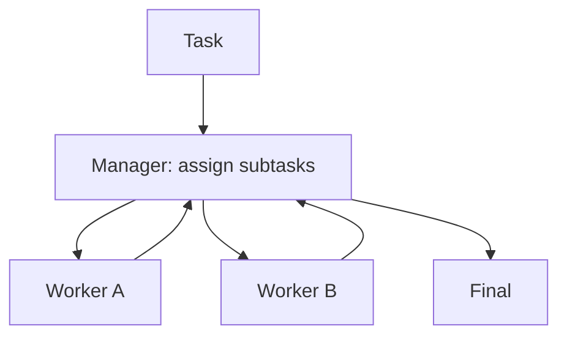

# Manager-Worker（主管-工人）

## 一句话（TL;DR）

Manager-Worker = **拆解→委派→汇总**：manager 派工给专长 worker，再把结果整合成一个最终输出。

## 你大概率需要它（症状）

- 任务天然能拆成“相对独立”的块。
- 你想要专长分工（不同工具/不同提示），但最终必须有一个统一输出。
- 你想更好 debug：失败能落到某个 worker 的一步。

## 解决的问题

复杂任务需要多种专长，单 agent 容易“既要又要还要”。Manager-Worker 引入：

- Manager：拆解与派工
- Workers：分别完成子任务
- Manager：汇总与整合

## 什么时候用

- 任务天然能拆成相对独立的子任务。
- 你想并行与专长分工，但最终输出仍需要一个“owner”统一把控。
- 你希望更好 debug：失败能定位到某个 worker 的某一步。

## 什么时候别用

- 任务是强线性的（每步都依赖上一步）→ workflow / PER 更简单。
- worker 需要在共享状态上紧密协作 → 冲突难控；不如单 agent + 工具，或用强控制的 group chat。
- manager 无法可靠校验整合结果 → 很容易拼出“看起来完整但其实错”的东西。

## 核心流程



## 手工走一遍（什么叫“靠谱的委派”）

1. Manager 派两份子任务，并把 I/O 写死：
   - Worker A：抽取事实 → 返回 JSON `{facts:[...]}`
   - Worker B：产出大纲 → 返回 JSON `{outline:[...]}`
2. Workers 各自执行（甚至可以用不同工具/不同提示）。
3. Manager 合并结构化结果；冲突时触发 resolver（或者回问某个 worker）。

如果 manager 连 I/O 契约都写不清，这套东西往往会退化成“两个 agent 聊天”，结果很难验。

## 它是如何运作的

Manager-Worker 把协作机制显式化：

1. **Manager** 先把任务拆成子任务，并给出清晰接口（输入/输出/验收标准）。
2. 每个 **Worker** 负责一个子任务（可用不同 prompt/工具/模型）。
3. Manager 汇总结果、解决冲突并输出最终产物。

当子任务可以并行、且 Manager 能对整合结果做校验时，这个模式尤其有效。

### 机制细节（让委派真的可用）

- **子任务契约**：manager 派工时写清 I/O（最好要求结构化输出）。
- **明确 ownership**：一个 worker 负责一个子任务；除非你刻意做冗余（比如 voting）。
- **聚合策略**：manager 合并结构化结果；冲突时触发 resolver（或回问某个 worker）。
- **预算**：限制 worker 调用次数；并行很容易把成本“藏起来”。

## 一个能对照的例子

```bash
UV_CACHE_DIR=.uv_cache PYTHONPATH=src uv run --no-sync python examples/60_manager_worker.py
```

??? example "示例代码（`examples/60_manager_worker.py`）"
    ```python
    --8<-- "examples/60_manager_worker.py"
    ```

## 常见失败模式与对策

- **拆解不合理**：用拆解 rubric；看完 worker 输出后允许重拆。
- **重复劳动**：给 worker 明确 ownership；用 task ledger 记录分工。
- **整合冲突**：强制 worker 输出结构化；增加 merge/一致性检查。
- **上下文爆炸**：worker 只拿最小上下文；回传给 manager 时做摘要。

## 演化路径

- 来源：routing + specialization
- 常见组合：agents-as-tools / group chat / handoff

## 本仓库对应

- 代码： [`src/agent_patterns_lab/patterns/manager_worker.py`](https://github.com/lifeodyssey/agent-patterns-lab/blob/main/src/agent_patterns_lab/patterns/manager_worker.py)
- 示例： [`examples/60_manager_worker.py`](https://github.com/lifeodyssey/agent-patterns-lab/blob/main/examples/60_manager_worker.py)
- 测试： [`tests/test_manager_worker.py`](https://github.com/lifeodyssey/agent-patterns-lab/blob/main/tests/test_manager_worker.py)

## 参考资料

- Agent Patterns — Orchestrator Agent（manager/worker 风格）：https://www.agentpatterns.tech/en/agent-patterns/orchestrator-agent
- Azure Architecture Center — AI agent orchestration patterns（多智能体取舍）：https://learn.microsoft.com/en-us/azure/architecture/ai-ml/guide/ai-agent-design-patterns
