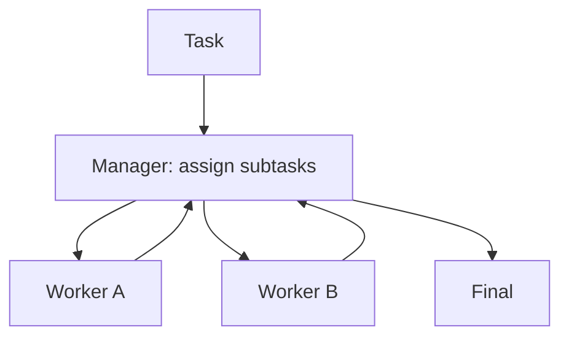

# Manager-Worker（主管-工人）

## 解决的问题

复杂任务需要多种专长，单 agent 容易“既要又要还要”。Manager-Worker 引入：

- Manager：拆解与派工
- Workers：分别完成子任务
- Manager：汇总与整合

## 核心流程

## 它是如何运作的

Manager-Worker 把协作机制显式化：

1. **Manager** 先把任务拆成子任务，并给出清晰接口（输入/输出/验收标准）。
2. 每个 **Worker** 负责一个子任务（可用不同 prompt/工具/模型）。
3. Manager 汇总结果、解决冲突并输出最终产物。

当子任务可以并行、且 Manager 能对整合结果做校验时，这个模式尤其有效。

## 常见失败模式与对策

- **拆解不合理**：用拆解 rubric；看完 worker 输出后允许重拆。
- **重复劳动**：给 worker 明确 ownership；用 task ledger 记录分工。
- **整合冲突**：强制 worker 输出结构化；增加 merge/一致性检查。
- **上下文爆炸**：worker 只拿最小上下文；回传给 manager 时做摘要。

## 演化路径

- 来源：routing + specialization
- 常见组合：agents-as-tools / group chat / handoff

## 本仓库对应

- 代码： [`src/agent_patterns_lab/patterns/manager_worker.py`](https://github.com/lifeodyssey/agent-patterns-lab/blob/main/src/agent_patterns_lab/patterns/manager_worker.py)
- 示例： [`examples/60_manager_worker.py`](https://github.com/lifeodyssey/agent-patterns-lab/blob/main/examples/60_manager_worker.py)
- 测试： [`tests/test_manager_worker.py`](https://github.com/lifeodyssey/agent-patterns-lab/blob/main/tests/test_manager_worker.py)
