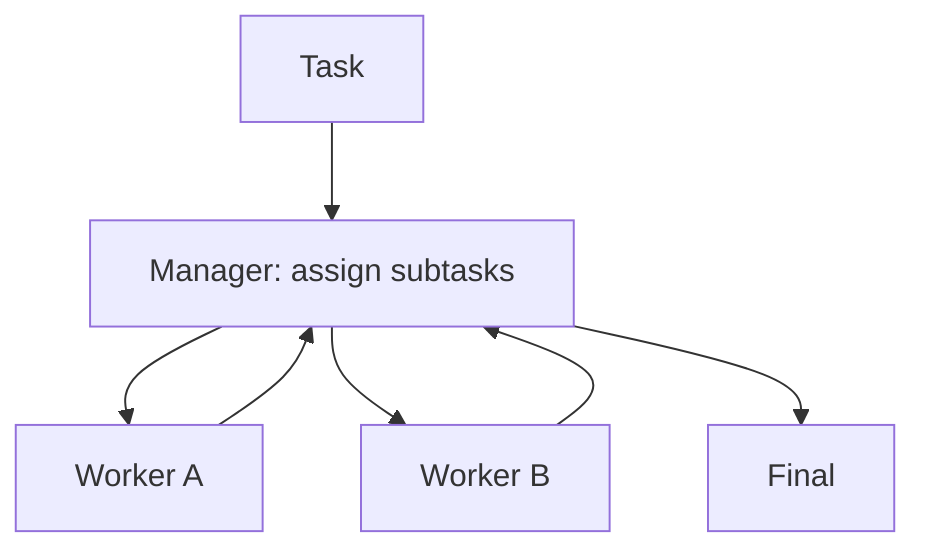

# Manager-Worker（主管-工人）

## 解决的问题

复杂任务需要多种专长，单 agent 容易“既要又要还要”。Manager-Worker 引入：

- Manager：拆解与派工
- Workers：分别完成子任务
- Manager：汇总与整合

## 核心流程

## 演化路径

- 来源：routing + specialization
- 常见组合：agents-as-tools / group chat / handoff

## 本仓库对应

- 代码：`src/agent_patterns_lab/patterns/manager_worker.py`
- 示例：`examples/60_manager_worker.py`
- 测试：`tests/test_manager_worker.py`

