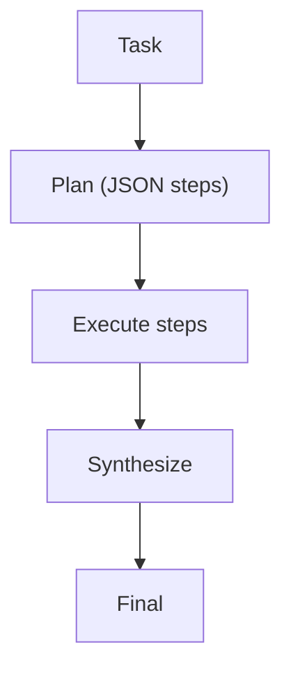

# Plan & Solve（先计划，再执行）

## 解决的问题

长任务直接“马上回答”容易崩。Plan & Solve 把任务拆成：

1. 生成计划（结构化）
2. 执行每一步
3. 汇总得到最终答案

## 核心流程

## 它是如何运作的

Plan & Solve 引入一个显式的“计划产物”：

1. **Plan**：模型输出步骤列表（最好结构化），并写清每步的完成条件。
2. **Execute**：按步骤执行，收集中间结果。
3. **Synthesize**：只基于可验证的中间结果汇总最终答案。

它的价值在于：把结构外化，减少“在长链路里迷路/跳步/漏步”。

## 常见失败模式与对策

- **计划不靠谱**（漏步骤/顺序错）：加 plan review；固定 plan 模板。
- **不按计划执行**：执行器逐步读取计划；记录偏离并追责。
- **现实不匹配**（工具输出推翻假设）：引入重规划（PER）或 replanner 角色。
- **过度规划**：限制 plan 长度；合并琐碎步骤。

## 演化路径

- 与工作流相似，但“步骤由模型生成”
- 走向：PER（中途重规划）、LLM Compiler（DAG 执行）

## 本仓库对应

- 代码： [`src/agent_patterns_lab/patterns/plan_and_solve.py`](https://github.com/lifeodyssey/agent-patterns-lab/blob/main/src/agent_patterns_lab/patterns/plan_and_solve.py)
- 示例： [`examples/50_plan_and_solve.py`](https://github.com/lifeodyssey/agent-patterns-lab/blob/main/examples/50_plan_and_solve.py)
- 测试： [`tests/test_plan_and_solve.py`](https://github.com/lifeodyssey/agent-patterns-lab/blob/main/tests/test_plan_and_solve.py)
