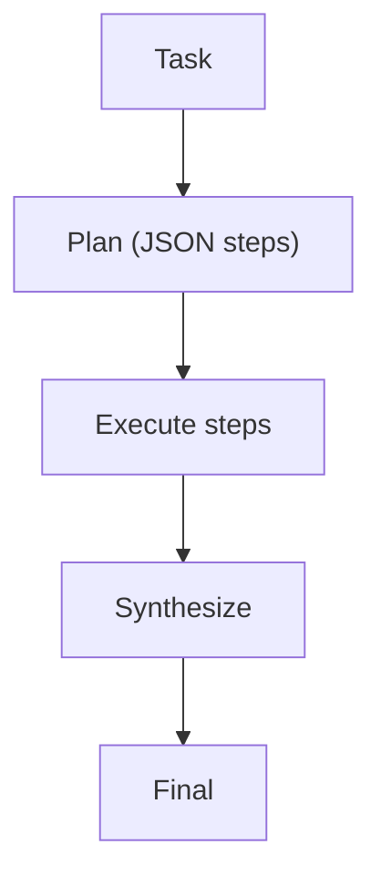

# Plan & Solve（先计划，再执行）

## 解决的问题

长任务直接“马上回答”容易崩。Plan & Solve 把任务拆成：

1. 生成计划（结构化）
2. 执行每一步
3. 汇总得到最终答案

## 核心流程

## 演化路径

- 与工作流相似，但“步骤由模型生成”
- 走向：PER（中途重规划）、LLM Compiler（DAG 执行）

## 本仓库对应

- 代码：`src/agent_patterns_lab/patterns/plan_and_solve.py`
- 示例：`examples/50_plan_and_solve.py`
- 测试：`tests/test_plan_and_solve.py`

