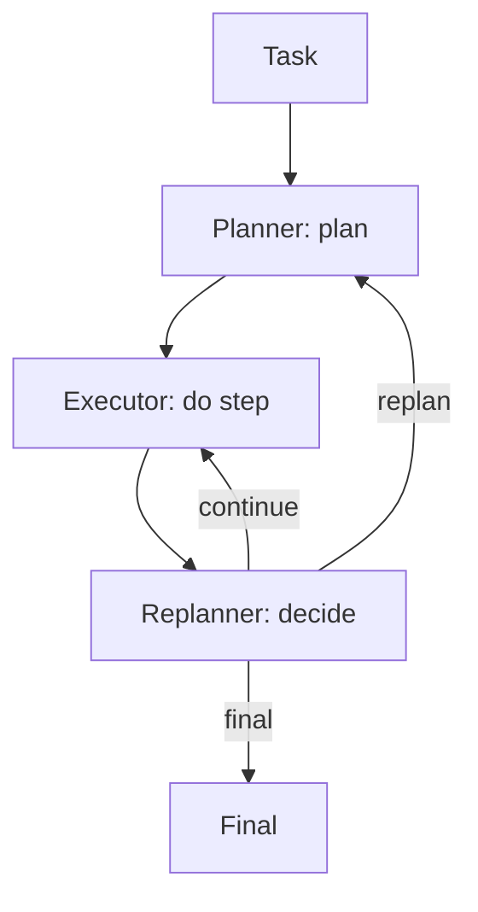

# PER（Planner-Executor-Replanner）

## 一句话（TL;DR）

PER 把“计划会变”当成一等公民：**plan → execute → decide（继续/重规划/结束）**。

## 你大概率需要它（症状）

- 你一开始有计划，但工具输出一来就把计划推翻。
- 你的系统经常“乱改方向”（重规划是隐式发生的，没人控）。
- 你能写清重规划触发条件（矛盾/缺前置/失败/预算风险）。

## 解决的问题

计划在执行过程中可能变得不对（新证据/失败/预算变化）。PER 引入 replanner 决策：

- continue
- replan
- final

## 什么时候用

- 执行过程中世界会变（工具输出会推翻原计划）。
- 你希望“是否重规划”是一个显式决策点，而不是边做边乱改。
- 你能定义 replan 触发条件（矛盾、新证据、失败、预算变化等）。

## 什么时候别用

- 计划基本稳定，很少被推翻 → Plan & Solve（或工作流）就够了。
- 你写不清“计划失效”的触发条件 → 只会靠感觉重规划，烧预算。
- 你的核心痛点是“需要看观测一步步决策” → 先从 ReAct 开始，再考虑加 PER。

## 核心流程



## 手工走一遍（一次 replan 是怎么发生的）

你可以把 PER 理解成“普通计划”，外加一个明确的决策点：

1. **Planner** 先产出计划（比如步骤 `[A, B, C]`）。
2. **Executor** 去执行 `A`，并把观测写下来。
3. **Replanner** 检查触发条件：
   - 观测和计划矛盾 → **replan**
   - 进展正常 → **continue**
   - 目标已达成 → **final**

重点不在“计划更聪明”，而在于：**重规划被显式化了，可测试、可控预算、可审计**。

## 它是如何运作的

PER 把“规划”变成一个持续进行的过程：

- **Planner**：产出初始计划产物（plan artifact）。
- **Executor**：严格按计划逐步执行，并记录观测与中间结果。
- **Replanner**：定期判断计划是否仍然成立，并决定：
  - 继续执行下一步
  - 基于最新状态重做计划
  - 结束并输出最终结果

把角色拆开能减少“边做边改导致的混乱”：执行更专注，重规划更显式、可审计。

### 机制细节（让重规划不发疯）

- **replan 触发条件**：工具失败、出现矛盾、缺前置、预算风险等，尽量结构化。
- **计划增量更新**：优先“改计划”，不要每次都推倒重来（插入/替换/删除 step）。
- **状态压缩**：replanner 看 ledger + 关键观测即可，别把整段 transcript 全喂回去。
- **重规划预算**：限制 replan 次数；频繁 replan 往往是工具不稳或计划 schema 不好。

## 一个能对照的例子

```bash
UV_CACHE_DIR=.uv_cache PYTHONPATH=src uv run --no-sync python examples/51_planner_executor_replanner.py
```

??? example "示例代码（`examples/51_planner_executor_replanner.py`）"
    ```python
    --8<-- "examples/51_planner_executor_replanner.py"
    ```

## 常见失败模式与对策

- **重规划过于频繁**：加阈值（只有出现矛盾/重大新证据才 replan）。
- **从不重规划**：强制周期性检查；给 replanner 明确 rubric。
- **角色职责混乱**：为每个角色固定输入输出 schema 与提示模板。
- **状态丢失**：把中间结果与决策写入 trace/ledger。

## 演化路径

- Plan & Solve 的升级：显式承认“计划会变”
- 常与 Retrieval 组合：新证据触发 replan

## 本仓库对应

- 代码： [`src/agent_patterns_lab/patterns/planner_executor_replanner.py`](https://github.com/lifeodyssey/agent-patterns-lab/blob/main/src/agent_patterns_lab/patterns/planner_executor_replanner.py)
- 示例： [`examples/51_planner_executor_replanner.py`](https://github.com/lifeodyssey/agent-patterns-lab/blob/main/examples/51_planner_executor_replanner.py)
- 测试： [`tests/test_per.py`](https://github.com/lifeodyssey/agent-patterns-lab/blob/main/tests/test_per.py)

## 参考资料

- Plan-and-Solve Prompting（计划产物思路）：https://arxiv.org/abs/2305.04091
- ReAct（带观测闭环的控制器）：https://arxiv.org/abs/2210.03629
