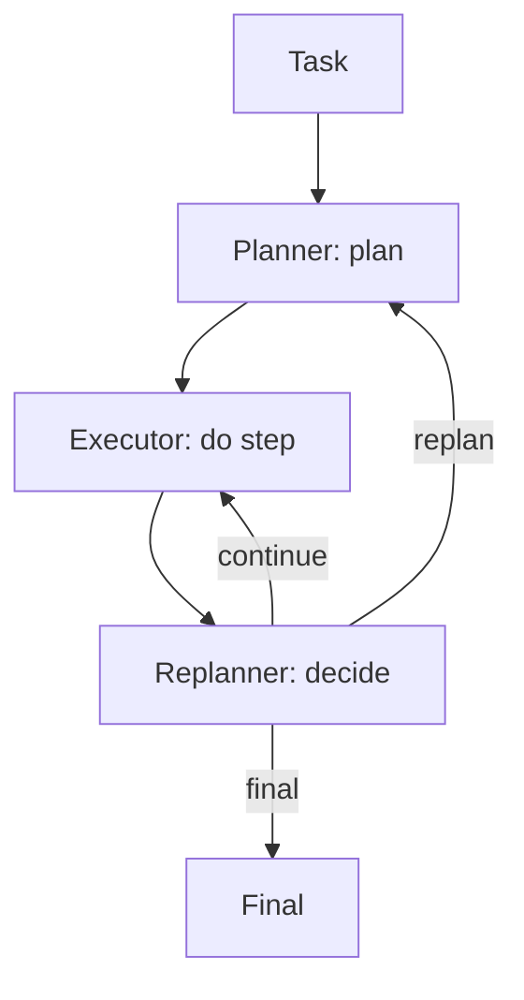

# PER（Planner-Executor-Replanner）

## 解决的问题

计划在执行过程中可能变得不对（新证据/失败/预算变化）。PER 引入 replanner 决策：

- continue
- replan
- final

## 核心流程

## 演化路径

- Plan & Solve 的升级：显式承认“计划会变”
- 常与 Retrieval 组合：新证据触发 replan

## 本仓库对应

- 代码：`src/agent_patterns_lab/patterns/planner_executor_replanner.py`
- 示例：`examples/51_planner_executor_replanner.py`
- 测试：`tests/test_per.py`

