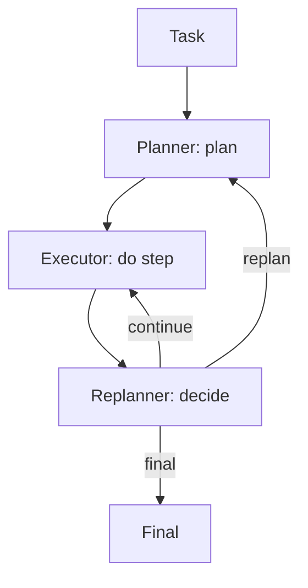

# PER（Planner-Executor-Replanner）

## 解决的问题

计划在执行过程中可能变得不对（新证据/失败/预算变化）。PER 引入 replanner 决策：

- continue
- replan
- final

## 核心流程

## 它是如何运作的

PER 把“规划”变成一个持续进行的过程：

- **Planner**：产出初始计划产物（plan artifact）。
- **Executor**：严格按计划逐步执行，并记录观测与中间结果。
- **Replanner**：定期判断计划是否仍然成立，并决定：
  - 继续执行下一步
  - 基于最新状态重做计划
  - 结束并输出最终结果

把角色拆开能减少“边做边改导致的混乱”：执行更专注，重规划更显式、可审计。

## 常见失败模式与对策

- **重规划过于频繁**：加阈值（只有出现矛盾/重大新证据才 replan）。
- **从不重规划**：强制周期性检查；给 replanner 明确 rubric。
- **角色职责混乱**：为每个角色固定输入输出 schema 与提示模板。
- **状态丢失**：把中间结果与决策写入 trace/ledger。

## 演化路径

- Plan & Solve 的升级：显式承认“计划会变”
- 常与 Retrieval 组合：新证据触发 replan

## 本仓库对应

- 代码： [`src/agent_patterns_lab/patterns/planner_executor_replanner.py`](https://github.com/lifeodyssey/agent-patterns-lab/blob/main/src/agent_patterns_lab/patterns/planner_executor_replanner.py)
- 示例： [`examples/51_planner_executor_replanner.py`](https://github.com/lifeodyssey/agent-patterns-lab/blob/main/examples/51_planner_executor_replanner.py)
- 测试： [`tests/test_per.py`](https://github.com/lifeodyssey/agent-patterns-lab/blob/main/tests/test_per.py)
