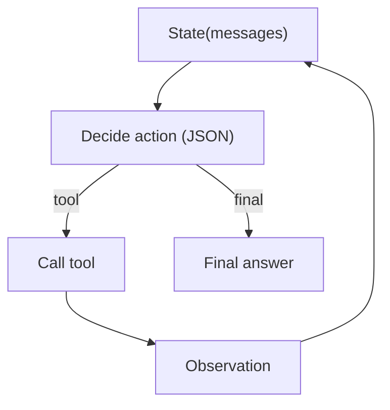

# ReAct（Reason → Act → Observe）

## 解决的问题

传统的提示技巧（例如“想清楚再回答”）在需要**与环境交互**时会失效：因为下一步决策必须依赖“观测”（工具输出/环境反馈）。

当下一步必须依赖观测时，你需要一个控制 loop，能够：

- 决定下一步做什么
- 调工具
- 写回 observation
- 重复直到完成

ReAct 是最典型的 Agent Loop：把“推理”和“行动”交替起来，让 Agent 通过新的观测不断校正下一步行为。

## 什么时候用

- 工具调用次数不确定
- 环境是交互式的（检索/API/文件等）
- 你需要明确的终止条件（final）

## 它是如何运作的（直觉版）

把 ReAct 看作一个最小的“闭环控制器”：

1. **State**：当前对话上下文 +（可选）账本/草稿/计划
2. **Decision**：决定下一步是调用哪个工具，还是直接结束
3. **Action**：执行工具
4. **Observation**：把工具输出追加回 State
5. 重复直到满足**终止条件**

和“一次性 tool calling”相比，loop 的价值在于它能：

- 在信息不足时继续探索（多次检索/多次工具）
- 在工具输出意外时自适应（换工具、改策略、追问澄清）
- 在证据足够时提前停止（节省成本）

## 核心流程（Action Schema）

## Prompt / 输出格式（两种常见形态）

ReAct 常见有两种“动作表达方式”：

1. **纯文本**：`Thought:` → `Action:` → `Observation:`（循环）→ `Final:`
2. **结构化动作**（更适合工程）：用 JSON 表达 next action，例如：
   - `{ \"type\": \"tool\", \"name\": \"search\", \"args\": {...} }`
   - `{ \"type\": \"final\", \"answer\": \"...\" }`

本仓库采用 **结构化动作**，以便 loop controller 稳定解析、打 trace、做 policy/guardrails。

## 常见失败模式与对策

- **原地打转/无限循环**：加最大步数、停滞检测、必要时“反思→重规划”。
- **工具选错**：加 routing、强化工具描述、或先做 planner step。
- **伪造 observation**：要求“观测只能来自工具输出”，再加 guardrails。
- **成本过高**：加缓存、预算、以及更激进的 early-stop 条件。

## 演化路径

- 基于：Tool calling + Structured output + Loop controller
- 常见特化：
  - Agentic RAG = ReAct + retrieval tool + evidence ledger
  - Governance = 在 tool call 前后加 policy/guardrails/HITL
  - 多智能体 = 多个 ReAct 子代理在一个协调器下协作（handoff / manager-worker）

## 本仓库对应

- 代码： [`src/agent_patterns_lab/patterns/react.py`](https://github.com/lifeodyssey/agent-patterns-lab/blob/main/src/agent_patterns_lab/patterns/react.py)
- 示例： [`examples/21_react_loop.py`](https://github.com/lifeodyssey/agent-patterns-lab/blob/main/examples/21_react_loop.py)
- 测试： [`tests/test_react.py`](https://github.com/lifeodyssey/agent-patterns-lab/blob/main/tests/test_react.py)

## 参考

- ReAct（Reason+Act）：Yao 等，2022。citeturn3search0
- Prompting Guide 的 ReAct 介绍页：citeturn2view0
