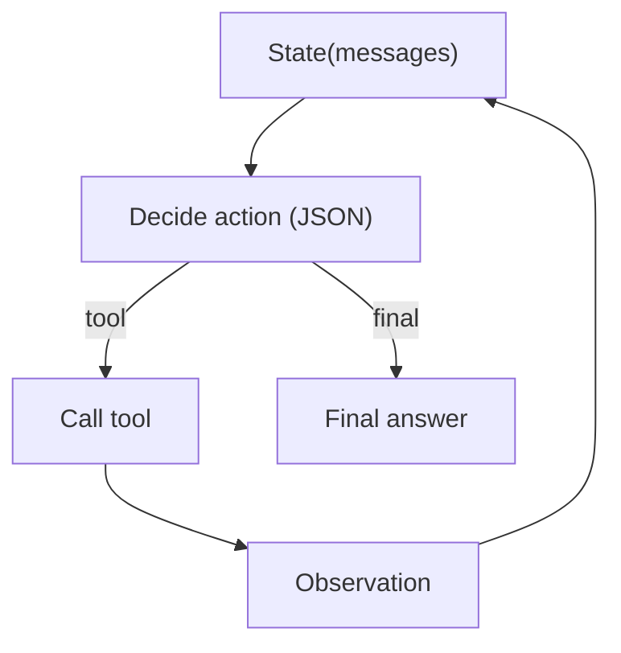

# ReAct（Reason → Act → Observe）

## 解决的问题

当下一步必须依赖“观测”（工具输出/环境反馈）时，你需要一个控制 loop：

- 决定下一步做什么
- 调工具
- 写回 observation
- 重复直到完成

## 什么时候用

- 工具调用次数不确定
- 环境是交互式的（检索/API/文件等）
- 你需要明确的终止条件（final）

## 核心流程（Action Schema）

## 演化路径

- 基于：Tool calling + Structured output + Loop controller
- 常见特化：
  - Agentic RAG = ReAct + retrieval tool + evidence ledger
  - Governance = 在 tool call 前后加 policy/guardrails/HITL

## 本仓库对应

- 代码：`src/agent_patterns_lab/patterns/react.py`
- 示例：`examples/21_react_loop.py`
- 测试：`tests/test_react.py`

