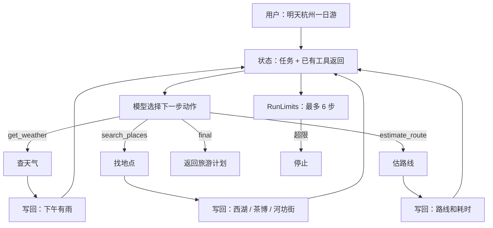
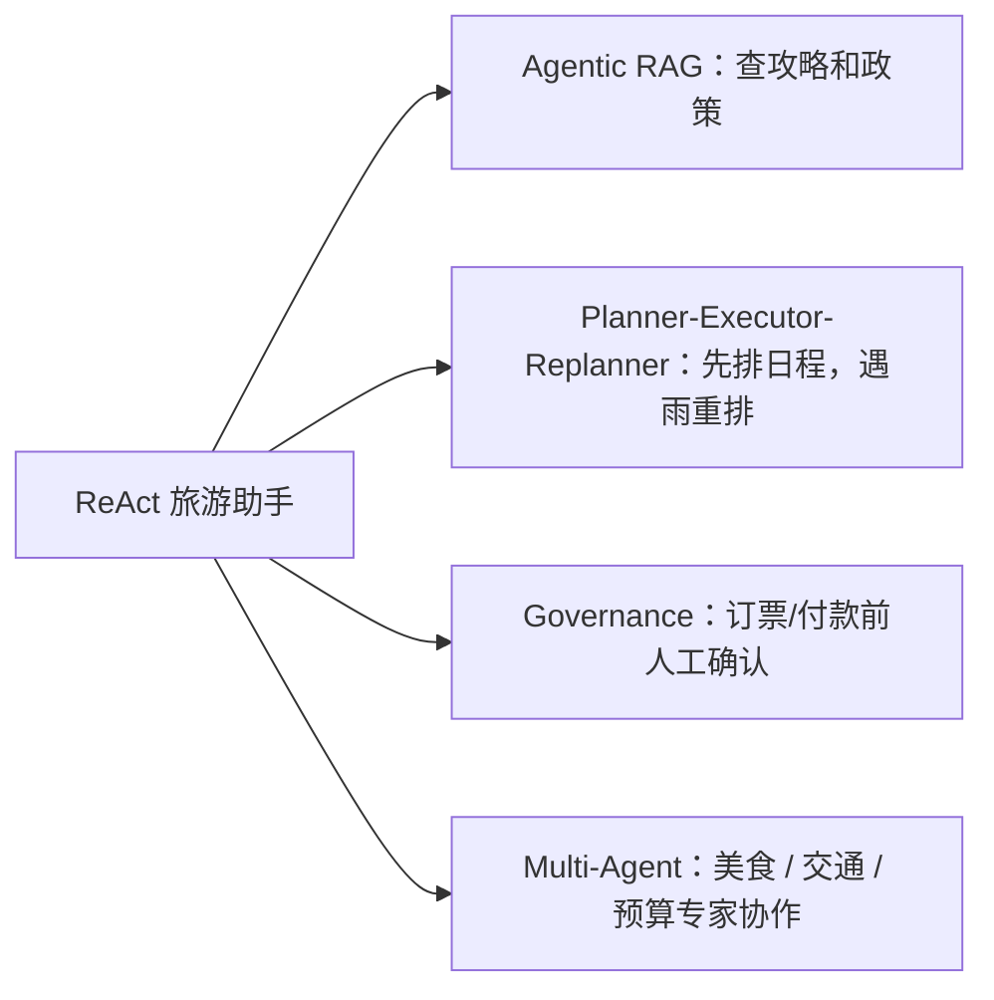

# ReAct：旅游规划助手的第一个 Agent 循环

如果你还没有看前面的演化过程，建议先读 [05：Agent Loop](../tutorial/05_agent_loop.md)。这一页不再把 ReAct 当作起点，而是把它当作 Chatbot 在“工具结果会影响下一步”时长出来的模式。

ReAct 解决的是一个很具体的问题：**模型不能只“想完再答”，它有时必须先做一步、看看结果，再决定下一步。**

旅游规划就是一个很自然的例子。用户说“明天去杭州玩一天，喜欢茶、本地小吃、轻松步行，帮我规划并告诉我要带什么”。模型不能凭空编路线，它应该先查天气，再找地点，再估路线，最后才回答。

这就是 ReAct 的位置：把模型输出变成“下一步动作”，再由 Python 代码执行动作、记录结果、决定是否继续。

## 先看完整代码

```python
--8<-- "examples/21_react_loop.py"
```

运行：

```bash
uv run python examples/21_react_loop.py
```

输出：

```text
Plan: West Lake in the morning, China National Tea Museum after the rain starts, then Hefang Street for snacks. Pack an umbrella, a light jacket, and comfortable shoes.
[trace] .traces/21_react_loop.jsonl
```

如果 import 失败，看 [命令解释](../run_commands.md)。

## 它为什么像 Agent

这个例子不是“调一次工具然后回答”。它至少做了三次决策：

| 第几轮 | 模型请求 | Python 做什么 | 得到什么 |
|---|---|---|---|
| 1 | 调 `get_weather` | 查询杭州明天天气 | 下午 3 点后小雨，18–23°C |
| 2 | 调 `search_places` | 根据兴趣和天气找地点 | 西湖、茶博、河坊街 |
| 3 | 调 `estimate_route` | 估算路线顺序和路上时间 | 先西湖，再转室内，再去小吃街 |
| 4 | 输出 `final` | 循环停止 | 给出计划和打包建议 |

这里真正重要的是控制权分工：

> 模型负责决定“下一步想做什么”；Python 负责决定“能不能做、怎么做、做完怎么记录、什么时候停”。

## 手工走一遍

第一轮，模型请求天气工具：

```json
{"type":"tool","tool":"get_weather","args":{"city":"Hangzhou","date":"tomorrow"}}
```

Python 查完天气，把工具返回写回消息历史。第二轮，模型再请求地点搜索：

```json
{"type":"tool","tool":"search_places","args":{"city":"Hangzhou","interests":["tea","local food","easy walking"],"constraint":"light rain after 15:00"}}
```

第三轮，它估路线：

```json
{"type":"tool","tool":"estimate_route","args":{"places":["West Lake","China National Tea Museum","Hefang Street"]}}
```

最后，模型看到已有信息足够，输出：

```json
{"type":"final","answer":"..."}
```

`run_react(...)` 看到 `final`，就返回答案。这个“看到动作 → 执行 → 写回 → 再问模型”的过程，就是 Agent 循环。

## 核心流程



## 核心实现

下面是 `run_react(...)`。读的时候抓住一件事：**循环不是模型自己跑的，是 Python 代码在控制。**

```python
--8<-- "src/agent_patterns_lab/patterns/react.py"
```

最关键的是内部的 `step(...)`：

- `structured_complete(...)` 要求模型只返回合法动作。
- 如果动作是 `final`，直接返回答案，循环结束。
- 如果动作是 `ask`，说明缺用户信息，抛出 `NeedUserInput`。
- 如果动作是 `tool`，就通过 `tools.call(...)` 执行工具，并把工具返回追加到 `messages`。

外层的 `run_loop(...)` 负责硬刹车：最多跑 `max_steps` 次。超过还没结束，就停。

## 它和论文里的 ReAct 是什么关系

论文和很多教程会把 ReAct 写成：

```text
Thought: 我需要先查天气。
Action: get_weather[Hangzhou, tomorrow]
Observation: 下午有雨。
Thought: 那下午应该安排室内项目。
Action: search_places[tea, indoor-friendly]
...
Final: ...
```

这个仓库保留同样的思想，但把动作写成 JSON：

```json
{"type":"tool","tool":"get_weather","args":{"city":"Hangzhou","date":"tomorrow"}}
```

原因很工程化：JSON 更容易解析、校验、记录和测试。纯文本 `Thought/Action/Observation` 很适合讲概念，但放进代码里容易被模型多余输出搞乱。

## ReAct 解决了什么问题

| 没有 ReAct 时 | ReAct 怎么帮忙 |
|---|---|
| 旅游计划容易凭空编。 | 先查天气、地点、路线，再回答。 |
| 固定流程不知道下一步该查什么。 | 每轮都根据上一次工具返回重新决定。 |
| 工具调用失败后不知道怎么办。 | 可以重试、换工具、或向用户追问。 |
| Agent 行为不可复盘。 | 每一步动作和工具返回都能写进 trace。 |

## 什么时候别用

- 如果只是在改写一句话，不需要 ReAct。
- 如果旅游计划步骤完全固定，用 Prompt Chaining 更简单。
- 如果只需要查一次天气，直接 tool call 就够。
- 如果工具会订票、付款、改订单，先加权限策略、护栏、人工确认，再让 Agent 调。

## 常见坑

| 坑 | 现象 | 修法 |
|---|---|---|
| 无限循环 | 一直查天气/地点，没有最终计划。 | 加 `max_steps`、超时、成本上限、停滞检测。 |
| 工具乱选 | 明明该估路线，却又去查天气。 | 改工具描述；按任务缩小工具白名单。 |
| 模型伪造工具结果 | 没调用工具，却说“天气晴”。 | 只信 Python runtime 写入的工具返回。 |
| 调用太贵 | 很多小步骤叠起来成本很高。 | 加缓存、提前停止、或改成固定流程。 |

## 它怎么继续演化



理解 ReAct 之后，后面的很多模式都会变简单：它们不是完全新的东西，而是在这个循环外面加结构——让旅游助手更会找资料、更会规划、更安全，或者更容易测试。

## 参考资料

- [ReAct 论文](https://arxiv.org/abs/2210.03629)
- [Prompting Guide：ReAct](https://www.promptingguide.ai/zh/techniques/react)
- [Anthropic：Building effective agents](https://www.anthropic.com/engineering/building-effective-agents)
- [实现：`src/agent_patterns_lab/patterns/react.py`](https://github.com/lifeodyssey/agent-patterns-lab/blob/main/src/agent_patterns_lab/patterns/react.py)
- [示例：`examples/21_react_loop.py`](https://github.com/lifeodyssey/agent-patterns-lab/blob/main/examples/21_react_loop.py)
