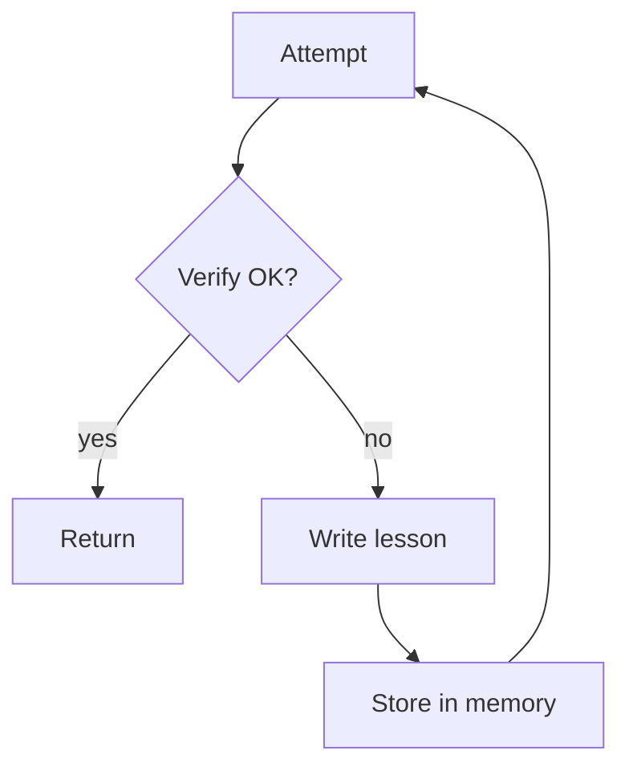

# Reflexion（失败→写 lesson→存 memory→重试）

## 解决的问题

当系统在同类任务上反复失败，你希望它能“写下教训”，并在下一轮显式遵循。

## 核心流程

## 演化路径

- 对 Maker-Checker/CoVe 的升级：把经验跨轮次保存
- 上线时配合 session memory + eval，避免漂移

## 本仓库对应

- 代码：`src/agent_patterns_lab/patterns/reflexion.py`
- 示例：`examples/42_reflexion.py`
- 测试：`tests/test_reflexion.py`

