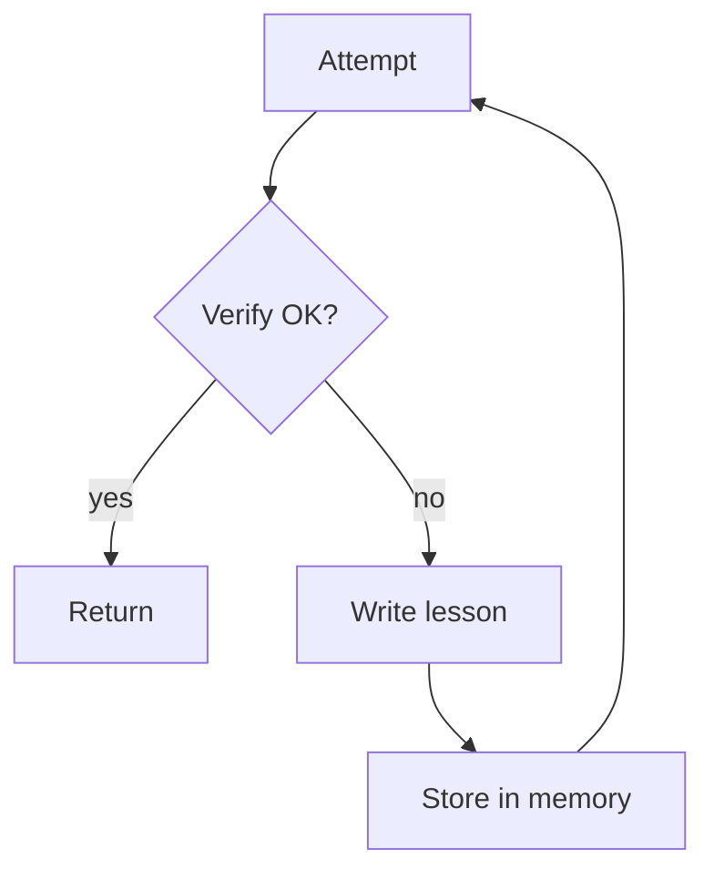

# Reflexion（失败→写 lesson→存 memory→重试）

## 解决的问题

当系统在同类任务上反复失败，你希望它能“写下教训”，并在下一轮显式遵循。

## 什么时候用

- 你看到重复失败，且失败原因有共性。
- 你能做“是否通过”的验证（tests/checker/约束/证据）。
- 你希望改进能跨轮次沉淀，而不是只对本次有效。

## 什么时候别用

- 你没法判断成败（没 checker/没测试/没 rubric）→ lesson 只会胡编。
- 任务是一次性的（不会重试/不会复用）→ 单次 maker-checker 更便宜。
- 失败主要来自“知识缺失” → 先加检索，再谈反思。

## 核心流程



## 它是如何运作的

Reflexion 把“一次失败”压缩成可复用的产物：

1. 先跑一轮尝试（agent/workflow）。
2. 用验证器判断结果是否通过（checker、测试、约束、证据等）。
3. 如果失败，让模型写出一条 **lesson**：
   - 哪里错了
   - 下次要怎么做
   - 最好是可执行的 checklist / 规则
4. 把 lesson 存到 memory，在下一次尝试开始前检索出来并显式遵循。

lesson 往往比原始对话更有价值：它更短、更通用、更容易迁移。

### 机制细节（让 lesson 可用）

- **lesson schema**：建议存 `{症状, 根因, 改法, checklist, 适用范围}`，不要只写“注意点”。
- **开跑前应用**：在 attempt #2 开始前就检索并注入 lesson（别等到最后再说）。
- **防事后合理化**：lesson 必须能指向观测证据（工具日志/失败检查项）。
- **衰减**：TTL / top-K 控制记忆规模，避免旧经验压制新情况。

## 一个能对照的例子

```bash
UV_CACHE_DIR=.uv_cache PYTHONPATH=src uv run --no-sync python examples/42_reflexion.py
```

## 常见失败模式与对策

- **写错教训**（事后合理化）：要求给出诊断证据；lesson 必须可测试。
- **过于泛化**（“要小心”）：强制模板（症状→原因→改法）。
- **记忆膨胀**：去重；只保留 top-K；设置 TTL。
- **套用错教训**：相似度检索 + 相关性评分；允许忽略低置信 lesson。

## 演化路径

- 对 Maker-Checker/CoVe 的升级：把经验跨轮次保存
- 上线时配合 session memory + eval，避免漂移

## 本仓库对应

- 代码： [`src/agent_patterns_lab/patterns/reflexion.py`](https://github.com/lifeodyssey/agent-patterns-lab/blob/main/src/agent_patterns_lab/patterns/reflexion.py)
- 示例： [`examples/42_reflexion.py`](https://github.com/lifeodyssey/agent-patterns-lab/blob/main/examples/42_reflexion.py)
- 测试： [`tests/test_reflexion.py`](https://github.com/lifeodyssey/agent-patterns-lab/blob/main/tests/test_reflexion.py)

## 参考资料

- Shinn 等（2023）：Reflexion：https://arxiv.org/abs/2303.11366
