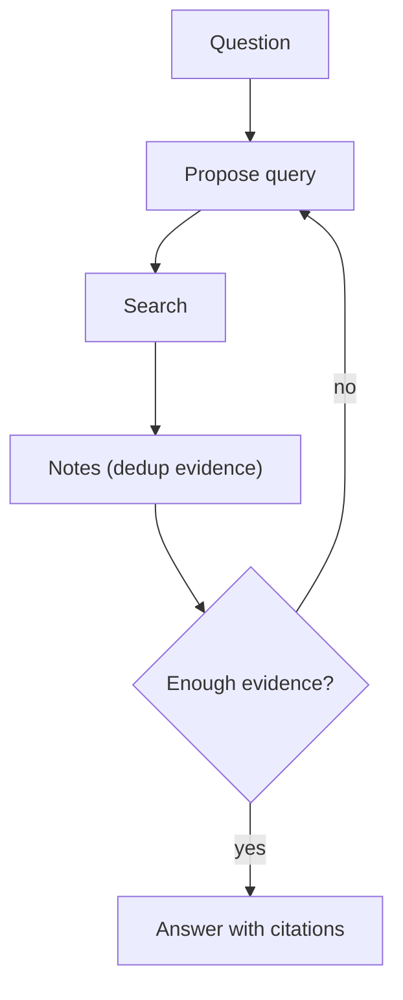

# Retrieval Loop（检索→阅读→改 Query→再检索）

## 解决的问题

一次检索常常漏掉关键证据。Retrieval loop 通过“发现缺口→改写 query”迭代提升覆盖。

## 核心流程

## 演化路径

- 来源：classic RAG（一次检索→一次生成）
- 走向：Agentic RAG（检索变成 agent loop 的一个工具）

## 本仓库对应

- 代码：`src/agent_patterns_lab/patterns/retrieval_loop.py`
- 示例：`examples/40_retrieval_loop.py`
- 测试：`tests/test_retrieval_loop.py`

