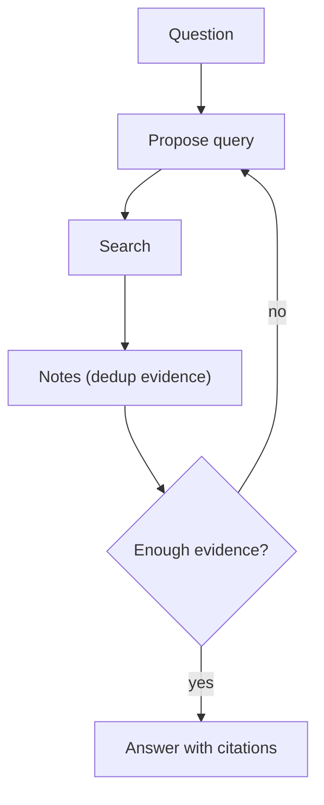

# Retrieval Loop（检索→阅读→改 Query→再检索）

## 解决的问题

一次检索常常漏掉关键证据。Retrieval loop 通过“发现缺口→改写 query”迭代提升覆盖。

## 核心流程



## 什么时候用

- 第一次检索经常不全或偏题。
- 你需要多来源证据来建立置信度。
- 你把“搜索”当作迭代过程，而不是一次 tool call。

## 什么时候别用

- 你的知识库很小，一条好 query 就能稳定命中 → 一次检索的 RAG 更简单更便宜。
- query 可以确定性写出来（filters/精确 id）→ 把检索做成 workflow step，不用 LLM 迭代。
- 你无法承受迭代成本 → 必须加硬预算，并把大多数请求路由到更轻路径。

## 它是如何运作的

1. 从问题生成初始 query。
2. 检索文档/片段。
3. 维护一个 **notes / evidence** 结构（去重、记录 doc_id）。
4. 判断证据是否足够；不够就根据“缺口”改写 query 再检索。
5. 最终基于证据回答，并给出引用。

### 机制细节（别让它退化成爬虫）

- **notes 要结构化**：存 `{doc_id, url, snippet, claims}`，否则去重和引用都会变成玄学。
- **停机条件要明确**：预算 + 收敛（连续 N 次检索没有新增 claim）比“我觉得够了”可靠。
- **改写要收敛**：保持稳定目标描述，只围绕缺口补齐，不要重写成另一个问题。
- **上下文卫生**：把原始检索文本当作不可信输入（注入是常态）。

## 一个能对照的例子

```bash
UV_CACHE_DIR=.uv_cache PYTHONPATH=src uv run --no-sync python examples/40_retrieval_loop.py
```

## 常见失败模式与对策

- **Query 漂移**（越搜越偏）：保持稳定目标描述；限制改写范围。
- **重复检索**：按 doc_id/hash 去重；对 query 做缓存。
- **检索内容注入**：加 guardrails；把“证据”与“指令”隔离。
- **无限搜索**：设预算（最大 query 次数/时间/token）。

## 演化路径

- 来源：classic RAG（一次检索→一次生成）
- 走向：Agentic RAG（检索变成 agent loop 的一个工具）

## 本仓库对应

- 代码： [`src/agent_patterns_lab/patterns/retrieval_loop.py`](https://github.com/lifeodyssey/agent-patterns-lab/blob/main/src/agent_patterns_lab/patterns/retrieval_loop.py)
- 示例： [`examples/40_retrieval_loop.py`](https://github.com/lifeodyssey/agent-patterns-lab/blob/main/examples/40_retrieval_loop.py)
- 测试： [`tests/test_retrieval_loop.py`](https://github.com/lifeodyssey/agent-patterns-lab/blob/main/tests/test_retrieval_loop.py)

## 参考资料

- Agent Patterns — Research Agent（把搜索 loop 做“有界”）：https://www.agentpatterns.tech/en/agent-patterns/research-agent
- Iterative retrieval-verification loops（综述风格）：https://www.emergentmind.com/topics/iterative-retrieval-verification-loops
