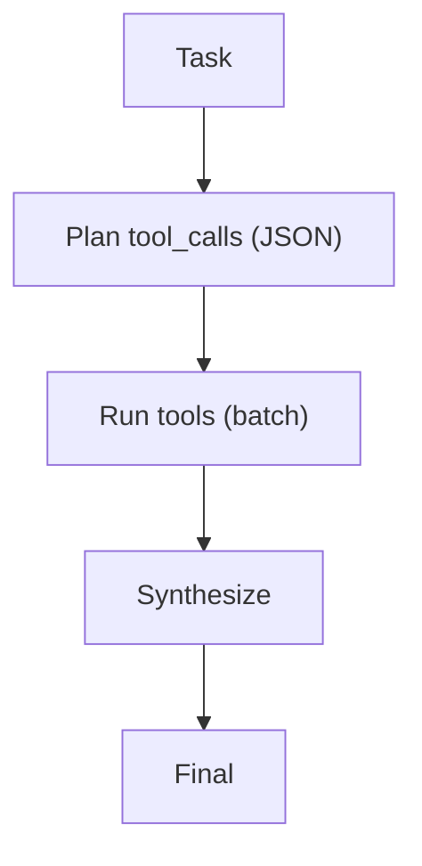

# REWOO（Reasoning Without Observation）

## 解决的问题

工具 loop 往返多次会很慢/很贵。REWOO 通过“先规划所有工具调用 → 批量执行 → 一次汇总”减少往返。

## 核心流程

## 演化路径

- 当工具成本主导时，是 ReAct 的 workflow 替代
- 常配合验证（CoVe/Maker-Checker）

## 本仓库对应

- 代码：`src/agent_patterns_lab/patterns/rewoo.py`
- 示例：`examples/52_rewoo.py`
- 测试：`tests/test_rewoo.py`

