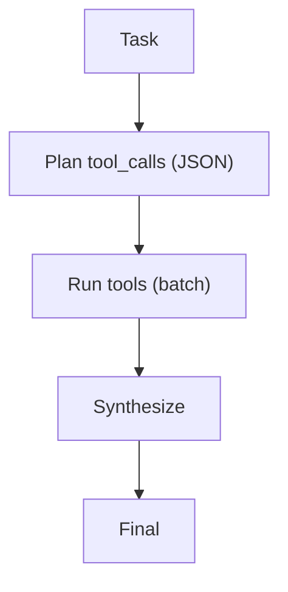

# REWOO（Reasoning Without Observation）

## 解决的问题

工具 loop 往返多次会很慢/很贵。REWOO 通过“先规划所有工具调用 → 批量执行 → 一次汇总”减少往返。

## 什么时候用

- 工具延迟/成本主导，且工具调用大多相互独立。
- 你能在没有中途 observation 的情况下预判所需工具调用。
- 你想减少 LLM 往返次数（控成本/控延迟）。

## 什么时候别用

- 下一步工具选择依赖观测 → 用 **ReAct**。
- 工具调用强依赖（A 的输出决定要不要调用 B）→ REWOO 容易过度调用或漏分支。
- 你需要强鲁棒的中途恢复 → 一个可控的 loop 往往比“一次批量”更安全。

## 核心流程



## 它是如何运作的

REWOO 用“少交互”换“少往返”：

1. 模型先把大部分工具调用规划出来（结构化列表）。
2. 系统批量执行工具调用（必要时可并行）。
3. 最后模型一次性读取全部 observation 并汇总出最终答案。

适用于：工具调用延迟/成本很高，且任务能较稳定地拆成相对独立的工具调用时。

### 机制细节（最好显式化）

- **计划格式**：工具调用列表建议用 `{name, args}`，必要时加依赖 key。
- **批量执行策略**：只并行真正独立的调用；对部分失败（缺 observation）要有明确处理策略。
- **回退路径**：汇总时发现信息不够，就再做一轮 batch 或直接回退 ReAct。

## 一个能对照的例子

```bash
UV_CACHE_DIR=.uv_cache PYTHONPATH=src uv run --no-sync python examples/52_rewoo.py
```

## 常见失败模式与对策

- **没有观测时计划就错了**：计划要短；允许第二轮规划；不行就回退 ReAct。
- **缺少中途决策**：只把 REWOO 用在“工具调用相互独立”的问题上。
- **单个工具失败导致整批失败**：为每个工具加重试与部分结果处理。
- **过度检索/过度调用**：加预算与去冗余裁剪。

## 演化路径

- 当工具成本主导时，是 ReAct 的 workflow 替代
- 常配合验证（CoVe/Maker-Checker）

## 本仓库对应

- 代码： [`src/agent_patterns_lab/patterns/rewoo.py`](https://github.com/lifeodyssey/agent-patterns-lab/blob/main/src/agent_patterns_lab/patterns/rewoo.py)
- 示例： [`examples/52_rewoo.py`](https://github.com/lifeodyssey/agent-patterns-lab/blob/main/examples/52_rewoo.py)
- 测试： [`tests/test_rewoo.py`](https://github.com/lifeodyssey/agent-patterns-lab/blob/main/tests/test_rewoo.py)

## 参考资料

- Xu 等（2023）：《ReWOO: Decoupling Reasoning from Observations for Efficient Augmented Language Models》https://arxiv.org/abs/2305.18323
