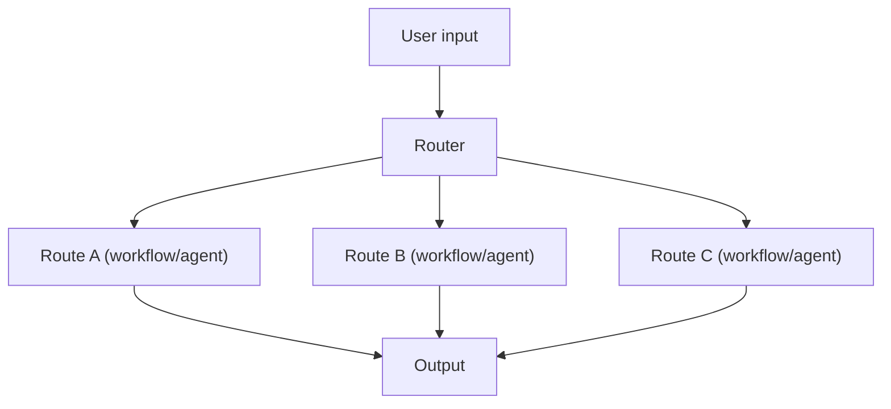

# Routing（规则路由 / LLM 路由）

## 解决的问题

当输入意图差异很大（数学/写作/检索/代码）时，一个统一流程会变成“平均主义”。  
Routing 用一个 Router 选择最合适的**专用流程**。

## 什么时候用

- 多意图、多任务类型
- 不同 route 有不同成本/延迟预算
- 希望把“下一步做什么”变得可控、可审计

## 核心流程

## 它是如何运作的

Routing 是一个“分流决策点”，决定下一步交给谁/走哪条控制流：

- **规则路由**：快、可预测（关键词/正则/小型启发式）。
- **LLM 路由**：更灵活（意图分类、选择工具/agent），但可能误分流。

常见的路由目标包括：

- 不同 workflow（prompt chain）
- 不同工具集合（tool set）
- 不同专用 agent（例如 research / code / writing）

## 常见失败模式与对策

- **误路由**：加置信阈值；失败时回退到默认路线。
- **规则越堆越复杂**：只保留高收益规则；用日志驱动迭代。
- **路由输出不稳定**：要求结构化 route 输出；加 routing 专项 eval。
- **成本失控**：优先路由到便宜模型；必要时再升级到更强模型/更重流程。

## 演化路径

- 来源：Prompt chaining（多个流程并存）
- 走向：Handoff/多智能体（在 agent 之间路由）、Agentic RAG（决定是否检索）

## 本仓库对应

- 代码： [`src/agent_patterns_lab/patterns/routing.py`](https://github.com/lifeodyssey/agent-patterns-lab/blob/main/src/agent_patterns_lab/patterns/routing.py)
- 示例： [`examples/12_routing.py`](https://github.com/lifeodyssey/agent-patterns-lab/blob/main/examples/12_routing.py)
- 测试： [`tests/test_routing.py`](https://github.com/lifeodyssey/agent-patterns-lab/blob/main/tests/test_routing.py)
