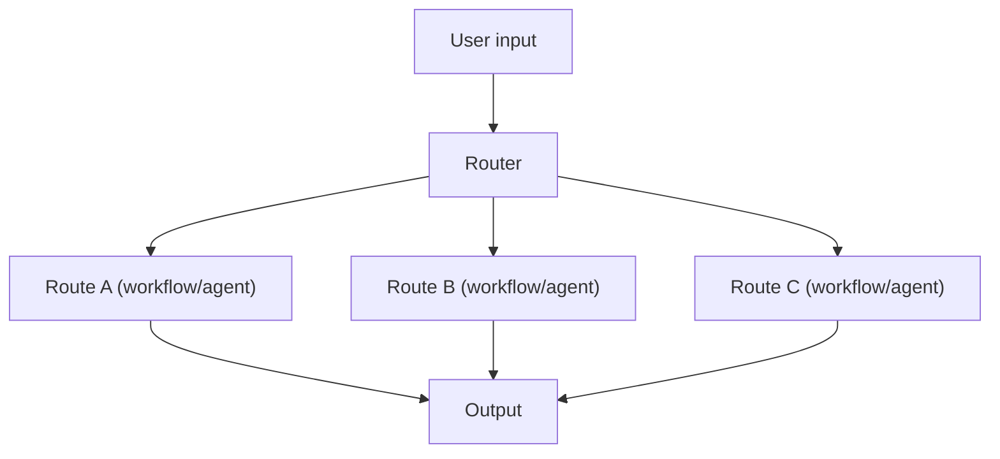

# Routing（规则路由 / LLM 路由）

## 一句话（TL;DR）

Routing 是一个“分流闸门”：先决定走哪条后续链路（workflow/agent/toolset），而不是用一个大 prompt 兼容所有任务。

## 你大概率需要它（症状）

- 你有明显不同的任务类型（算数/研究/写作/代码）。
- 不同任务需要不同的工具、预算或安全策略。
- 你经常在 debug 时卡在“它为什么下一步做这个？”——需要一个显式决策点。

## 解决的问题

当输入意图差异很大（数学/写作/检索/代码）时，一个统一流程会变成“平均主义”。  
Routing 用一个 Router 选择最合适的**专用流程**。

## 什么时候用

- 多意图、多任务类型
- 不同 route 有不同成本/延迟预算
- 希望把“下一步做什么”变得可控、可审计

## 什么时候别用

- 你其实只有 1–2 条“路线”，差异不大 → 保持一个流程更简单。
- 任务需要**动态委派**（跑着跑着才知道需要谁）→ 更像 **handoff** 或多智能体编排。
- 你没法定义“路由对不对” → 误路由永远 debug 不清（先做一个简单分类器 + 日志）。

## 核心流程



## 手工走一遍（一次最小路由决策）

输入：“Compute 2+2.”

1. Router 先给出 route id（比如 `"math"`）。
2. 系统运行这个 route 绑定的 controller（workflow 或 agent）。
3. 输出结果，并把 route 记录在 trace/log 里（方便复盘 misroute）。

当你需要**按路线绑定不同工具白名单/不同预算**时，Routing 就开始值钱了。

## 它是如何运作的

Routing 是一个“分流决策点”，决定下一步交给谁/走哪条控制流：

- **规则路由**：快、可预测（关键词/正则/小型启发式）。
- **LLM 路由**：更灵活（意图分类、选择工具/agent），但可能误分流。

常见的路由目标包括：

- 不同 workflow（prompt chain）
- 不同工具集合（tool set）
- 不同专用 agent（例如 research / code / writing）

### 机制细节（让路由稳定）

- **route id 是契约**：保持一个小而稳定的集合（例如 `"math"`, `"research"`, `"code"`）。
- **置信度 + 回退**：不确定就走安全默认路由（或先问一个澄清问题）。
- **按路由绑定策略**：不同 route 绑定不同 tool allowlist 与预算（“research 能搜；answer 不能写文件”）。
- **路由专项评测**：做一个小的标注集，量化 misroute rate，比凭感觉改 prompt 更靠谱。

## 一个能对照的例子

```bash
UV_CACHE_DIR=.uv_cache PYTHONPATH=src uv run --no-sync python examples/12_routing.py
```

??? example "示例代码（`examples/12_routing.py`）"
    ```python
    --8<-- "examples/12_routing.py"
    ```

## 常见失败模式与对策

- **误路由**：加置信阈值；失败时回退到默认路线。
- **规则越堆越复杂**：只保留高收益规则；用日志驱动迭代。
- **路由输出不稳定**：要求结构化 route 输出；加 routing 专项 eval。
- **成本失控**：优先路由到便宜模型；必要时再升级到更强模型/更重流程。

## 演化路径

- 来源：Prompt chaining（多个流程并存）
- 走向：Handoff/多智能体（在 agent 之间路由）、Agentic RAG（决定是否检索）

## 本仓库对应

- 代码： [`src/agent_patterns_lab/patterns/routing.py`](https://github.com/lifeodyssey/agent-patterns-lab/blob/main/src/agent_patterns_lab/patterns/routing.py)
- 示例： [`examples/12_routing.py`](https://github.com/lifeodyssey/agent-patterns-lab/blob/main/examples/12_routing.py)
- 测试： [`tests/test_routing.py`](https://github.com/lifeodyssey/agent-patterns-lab/blob/main/tests/test_routing.py)

## 参考资料

- Azure Architecture Center — AI agent orchestration patterns（handoff / deterministic routing）：https://learn.microsoft.com/en-us/azure/architecture/ai-ml/guide/ai-agent-design-patterns
- Agent Patterns — Routing Agent Pattern（偏实践）：https://www.agentpatterns.tech/en/agent-patterns
