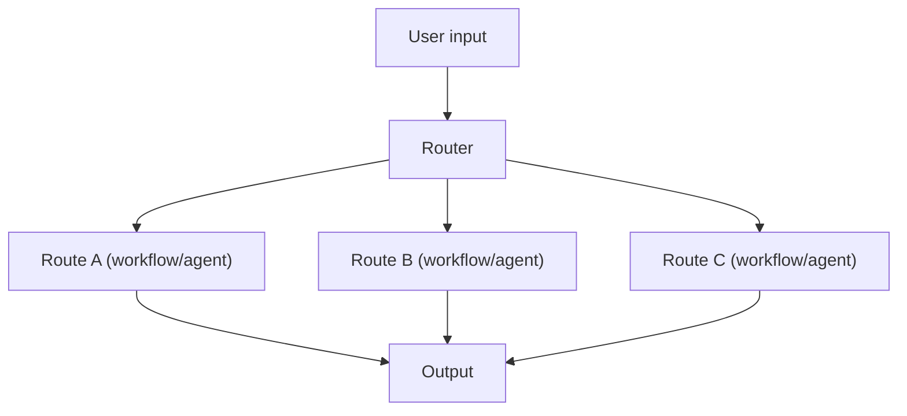

# Routing（规则路由 / LLM 路由）

## 解决的问题

当输入意图差异很大（数学/写作/检索/代码）时，一个统一流程会变成“平均主义”。  
Routing 用一个 Router 选择最合适的**专用流程**。

## 什么时候用

- 多意图、多任务类型
- 不同 route 有不同成本/延迟预算
- 希望把“下一步做什么”变得可控、可审计

## 核心流程

## 演化路径

- 来源：Prompt chaining（多个流程并存）
- 走向：Handoff/多智能体（在 agent 之间路由）、Agentic RAG（决定是否检索）

## 本仓库对应

- 代码：`src/agent_patterns_lab/patterns/routing.py`
- 示例：`examples/12_routing.py`
- 测试：`tests/test_routing.py`

