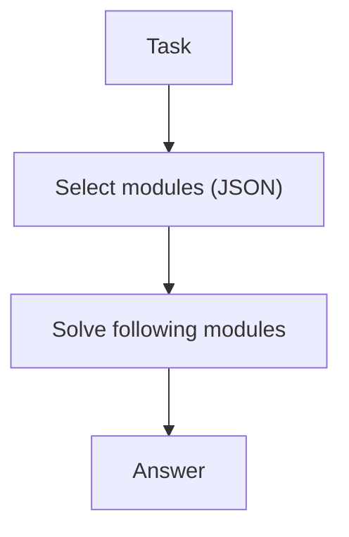

# Self-Discovery（先选策略模块，再解题）

## 解决的问题

不同任务适合不同策略（检查、简化、拆解…）。Self-Discovery 让模型先“选模块”，再按模块指导解题。

## 核心流程

## 演化路径

- 常作为规划/搜索 loop 的“策略选择”
- 可与 PER/LATS 组合

## 本仓库对应

- 代码：`src/agent_patterns_lab/patterns/self_discovery.py`
- 示例：`examples/55_self_discovery.py`
- 测试：`tests/test_self_discovery.py`

