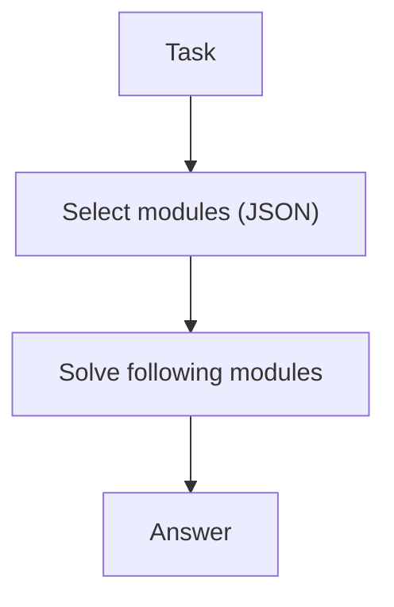

# Self-Discovery（先选策略模块，再解题）

## 解决的问题

不同任务适合不同策略（检查、简化、拆解…）。Self-Discovery 让模型先“选模块”，再按模块指导解题。

## 什么时候用

- 你希望策略显式化（“我们到底用哪套打法？”）。
- 你有一小套可复用的 reasoning checklist/模块。
- 你想让同类任务的解法更一致、更可控。

## 什么时候别用

- 模块库又虚又大 → 选择会变随机；先缩小并写具体再说。
- 任务本来就很简单 → 多一次“选模块”调用没有收益。
- 你无法容忍“选了但不执行”的漂移 → 更适合确定性 workflow。

## 核心流程



## 它是如何运作的

Self-Discovery 把“选策略”和“执行策略”拆开：

1. 维护一个小型的策略模块库（例如：拆解、验证、检索、简化等）。
2. 先让模型选择本任务适用的模块（结构化输出）。
3. 再进入解题步骤，并要求显式遵循所选模块的检查点。

好处是：模型会先对策略做承诺，再进入细节，整体更一致。

### 机制细节（让模块真的有用）

- **模块就是 checklist**：每个模块写清“怎么做”和“输出什么”，别写口号。
- **选择要有上限**：最多选 `k` 个；并要求一句话说明“为什么选这些”。
- **组合顺序很关键**：拆解→解题→验证，和验证→拆解，效果不一样。
- **失败后可重选**：快速自检不过，就允许更换模块集合。

## 一个能对照的例子

```bash
UV_CACHE_DIR=.uv_cache PYTHONPATH=src uv run --no-sync python examples/55_self_discovery.py
```

## 常见失败模式与对策

- **模块描述太虚**：把模块写成具体 checklist（输入/输出/检查点）。
- **选错模块**：给更多例子；允许在快速自检后重新选择。
- **策略表演**（选了但不执行）：为每个模块设置强制检查点（show work）。
- **模块过多**：限制选择数量；保持模块库小而精。

## 演化路径

- 常作为规划/搜索 loop 的“策略选择”
- 可与 PER/LATS 组合

## 本仓库对应

- 代码： [`src/agent_patterns_lab/patterns/self_discovery.py`](https://github.com/lifeodyssey/agent-patterns-lab/blob/main/src/agent_patterns_lab/patterns/self_discovery.py)
- 示例： [`examples/55_self_discovery.py`](https://github.com/lifeodyssey/agent-patterns-lab/blob/main/examples/55_self_discovery.py)
- 测试： [`tests/test_self_discovery.py`](https://github.com/lifeodyssey/agent-patterns-lab/blob/main/tests/test_self_discovery.py)

## 参考资料

- Zhou 等（2024）：Self-Discover（自动组合推理模块）：https://arxiv.org/abs/2402.03620
- Agent Patterns — Self-Discovery pattern page：https://agent-patterns.readthedocs.io/en/stable/patterns/self-discovery.html
