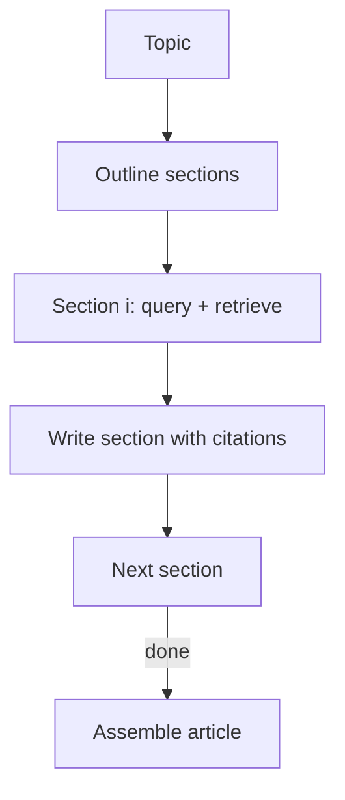

# STORM（研究写作：分段检索 + 组装）

## 解决的问题

研究写作不是一次 query：你需要先有结构，再逐段补证据，然后组装。

- 先 outline
- 每节独立检索证据
- 每节写作要落地到证据
- 最后 assemble

## 核心流程

## 它是如何运作的

STORM 风格把“文章”当作结构化产物来生产：

1. 先产出 **大纲**（章节结构 + 每节关键问题）。
2. 对每一节：
   - 围绕本节问题做检索补证据
   - 用证据写出可落地的段落，并给出引用
3. 把各节组装为完整文章。
4. 可选：最后跑一轮 **编辑器**（一致性/冗余/语气/缺失引用）。

关键设计点：检索是 **按章节作用域** 来做的，可以显著减少“证据串台”。

## 常见失败模式与对策

- **大纲太浅**：用 rubric 迭代大纲（覆盖度、顺序、目标读者）。
- **证据混用**：每节维护独立 evidence ledger；按段落引用。
- **上下文溢出**：每节做摘要与笔记；不要把整份语料塞回去。
- **伪造引用**：引用必须来自 retriever 的 doc_id；对引用存在性做验证。

## 演化路径

- 基于 Retrieval Loop 家族
- 可与 Agentic RAG 结合（每节动态决定检索次数）

## 本仓库对应

- 代码： [`src/agent_patterns_lab/patterns/storm.py`](https://github.com/lifeodyssey/agent-patterns-lab/blob/main/src/agent_patterns_lab/patterns/storm.py)
- 示例： [`examples/56_storm.py`](https://github.com/lifeodyssey/agent-patterns-lab/blob/main/examples/56_storm.py)
- 测试： [`tests/test_storm.py`](https://github.com/lifeodyssey/agent-patterns-lab/blob/main/tests/test_storm.py)
